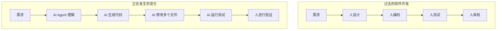
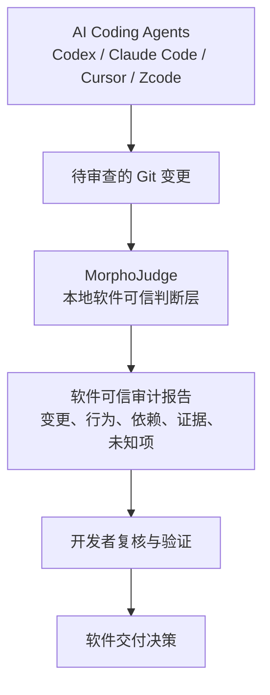
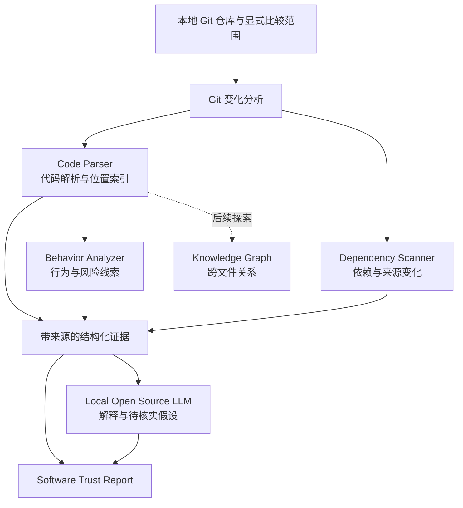

# MorphoJudge · 闪蝶判官

**AI 时代的软件可信判断层。**

MorphoJudge is a local-first open-source AI software trust layer that helps developers understand, verify and trust AI-generated software.

> 当前阶段：项目初始化与设计讨论。尚无可运行的分析器、CLI 或模型适配器。本文中的 v0.1 功能与架构均为开发目标，不代表已经实现。

## 1. 项目故事

我是一个重度 AI Coding 使用者。日常开发中，我大量使用 Codex、Claude Code、Zcode、Cursor 和其他 AI Agent 开发工具。它们极大提升了我的开发效率，也改变了我参与软件开发的方式。

过去，我从需求出发，设计、编码、测试，再审核代码。现在，AI Agent 可以理解需求、生成代码、修改多个文件、运行测试，而我需要验证它交付的结果。



在长期使用过程中，一个问题越来越明显：**AI 生成代码的速度，正在超过我理解代码的速度。**

AI 可以快速完成需求、创建复杂模块、修改大量文件、引入新的依赖。代码可以运行，测试也可能通过。但是，我真的理解它做了什么吗？

MorphoJudge 从这个疑问开始。我们希望利用本地模型和软件分析技术，帮助开发者重新获得对 AI 生成代码的理解、验证和控制能力。

## 2. 为什么出现这个问题

### AI 生成代码正在成为新的黑盒

一次任务可能修改几十个文件、创建复杂结构，甚至重构系统。开发者仍然需要回答：为什么这样设计？是否符合需求？会影响哪些模块？是否隐藏风险？

代码可见，并不意味着行为、设计动机和影响范围容易理解。

### 生成成本下降，理解和验证的负担上升

过去，时间更多花在编写代码上；现在，一部分时间转移到理解和验证大量变更上。“开发 80%、审核 20%”到“生成 20%、理解 80%”是一种表达这种体验的示意，**不是研究结论或统计数据**。

我们关心的不是单纯提高生成速度，而是让开发者能够跟上变化，并知道哪些地方值得重点检查。

*插图规划：[生成速度与理解速度](assets/diagrams/README.md#speed)。更多问题定义见 [问题文档](docs/problem.md)。*

## 3. AI 时代的软件可信挑战

### 非预期行为不一定来自恶意

一次变更可能新增外部网站访问、未知 API 调用、敏感数据上传路径、未知依赖、危险系统命令，或改变权限逻辑。

问题不是 AI 一定有恶意，而是开发者难以快速确认：这些行为是否存在，是否必要，是否符合需求，以及判断依据是什么。

*插图规划：[隐藏行为与软件检查](assets/diagrams/README.md#behavior)。*

### 企业需要可追溯的交付依据

企业需要回答：AI 生成了什么？修改是否符合要求？是否存在安全风险？还需要哪些检查，才能决定是否进入生产环境？

传统代码审查流程正在面对更大的变更量。模型生成的一段解释无法单独承担生产准入判断。

*插图规划：[企业软件治理](assets/diagrams/README.md#enterprise)。*

### 为什么不能简单上传给云端大模型检查

对许多团队来说，私有代码不能离开环境，代码涉及知识产权，大型仓库的处理成本也难以忽略。即使模型部署在本地，用一个黑盒 AI 检查另一个黑盒 AI，也不会自动产生可信结论。

因此，MorphoJudge 选择 **Local First**，并要求判断能够回到具体代码、分析规则和明确的适用范围。本地部署解决数据边界问题；可复核证据解决判断依据问题，两者都需要认真设计。

## 4. MorphoJudge 的解决方案

MorphoJudge 的目标是在 AI Coding 之后增加一个软件可信验证层。它不是以 IDE 插件为核心的项目，也不希望替代 AI Coding 工具；静态扫描是其中一个组成部分。



“可信”在这里意味着判断有依据、范围可说明、未知项可见。它不意味着工具能够证明软件绝对安全，或代替人工批准上线。

项目愿景与边界见 [vision.md](docs/vision.md)。

## 5. 系统架构

以下为目标架构，部分组件将在后续版本探索。



本地模型负责帮助理解，证据提取与最终结论需要保留独立的可复核路径。模型不可用时，目标是仍可输出基础分析报告。

*插图规划：[整体架构](assets/diagrams/README.md#architecture)；设计细节见 [architecture.md](docs/architecture.md)。*

## 6. 技术路线

核心原则是 **Local First + Open Source Model**：利用开发者的 GPU 工作站、本地服务器或企业内部环境，让代码分析与模型推理留在受控环境中。

拟评估的模型包括 Qwen Coder、DeepSeek Coder、CodeLlama、StarCoder；拟评估的推理运行时包括 Ollama、llama.cpp、vLLM。模型与推理运行时是不同层次，当前均未适配。具体版本、许可证、硬件需求及兼容性需要分别验证，不能因为可以本地运行就统一宣称其许可证完全开放。


v0.1 的范围是：**Git 仓库 → 本地分析 → 可信审计报告**。

| 能力       | v0.1 目标                   | 明确边界               |
| -------- | ------------------------- | ------------------ |
| Git 变化分析 | 新增、修改、删除及 Diff 内容         | 比较范围必须显式记录         |
| 软件结构理解   | 项目结构、模块关系、支持范围内的调用线索      | 不承诺完整跨语言调用图        |
| 行为分析     | 网络、外部 API、Shell、文件、权限相关线索 | 线索不等于行为已执行或漏洞已确认   |
| 依赖分析     | 新增依赖、来源变化、风险线索            | 未知来源不等于恶意，无情报不等于安全 |
| 本地 AI 解释 | 修改目的假设、潜在风险、人工关注位置        | 解释引用证据，保留不确定性      |

首个支持语言、解析器、实现语言与首个运行时尚待设计评估，不同时铺开全部生态。

*插图规划：[本地数据流](assets/diagrams/README.md#local-first)。*

## 7. Demo 展示

**当前没有可运行 Demo。** [报告示意](examples/README.md) 使用虚构变更说明未来报告应呈现的信息，不是扫描结果，也不是能力验证。

首个可运行 Demo 的目标：审查一个最小示例仓库中的 Git 变更，展示网络访问、Shell 调用和依赖变化的代码证据，以及本地模型的解释。届时补充实际命令、复现环境和截图。

## 8. Roadmap

| 阶段           | 目标                           | 状态            |
| ------------ | ---------------------------- | ------------- |
| P0：问题与文档     | 愿景、问题边界、架构草案、开放问题、贡献流程       | 已建立文档框架，待社区讨论 |
| P1：设计与 Issue | 确定首个语言、证据格式、Git 范围、模型边界与验收样例 | 待开展           |
| P2：v0.1      | 实现本地仓库分析与报告的最小闭环             | 规划中           |
| P3：质量与扩展     | 评测、更多语言、更多本地运行时与关系分析         | 探索中           |

详细交付条件见 [roadmap.md](docs/roadmap.md)，待建 Issue 草案见 [issues.md](docs/issues.md)。不预设未经验证的发布日期。

## 9. Open Problems

我们公开记录还没有答案的问题：如何理解 AI 生成代码的意图？如何降低大型项目分析成本？如何让小模型帮助理解百万级代码？如何跨语言建立统一代码知识图谱？如何发现隐藏行为？如何减少误报？

这些问题不是已经解决的功能清单，而是邀请社区共同研究的方向。详见 [open-problems.md](docs/open-problems.md)。

## 10. 社区贡献

MorphoJudge 希望聚集 AI 工程师、软件开发者、安全研究人员和架构师，共同探索：AI 时代如何理解和信任 AI 创造的软件。

当前最有价值的贡献包括真实审查场景、可公开的最小复现、问题定义、架构讨论、误报样例和评测方法。请先阅读 [贡献指南](docs/contribution.md)，再从文档或一个边界清楚的 Issue 开始。

*插图规划：[开源社区与数字闪蝶](assets/diagrams/README.md#community)。*

开发流程：**分析问题 → 设计方案 → 形成公开文档 → 拆解 Issue → 开发代码**。

### 仓库导航

```text
MorphoJudge/
├── README.md
├── docs/
│   ├── vision.md
│   ├── problem.md
│   ├── architecture.md
│   ├── roadmap.md
│   ├── open-problems.md
│   ├── contribution.md
│   └── issues.md
├── src/
│   ├── analyzer/
│   ├── parser/
│   ├── scanner/
│   ├── llm/
│   └── report/
├── examples/
├── assets/
│   ├── logo/
│   ├── diagrams/
│   └── screenshots/
├── models/
├── plugins/
├── tests/
├── .gitignore
├── LICENSE
└── PRIVATE/                 # 仅本地存在，不提交 Git
```

公开内容包括愿景、需求、技术设计、架构、Issue、开放问题、已验证方案和开源代码。设计草案必须标记状态，实验结果只有在可复核后才作为结论发布。

AI 聊天记录、私人计划、技术推演、实验过程、失败尝试和临时想法保存在 `PRIVATE/`。该目录及其他私有路径已加入 `.gitignore`；忽略规则不等同于加密或访问控制。

## 许可证

本仓库采用 [MIT License](LICENSE)。未来使用的第三方模型、依赖和素材遵循各自许可证，不由本仓库许可证重新授权。
