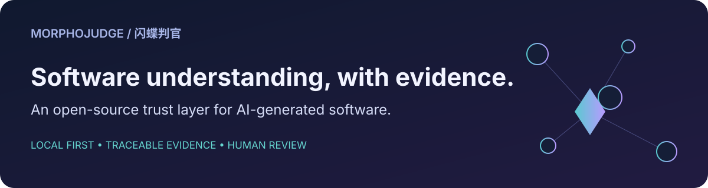
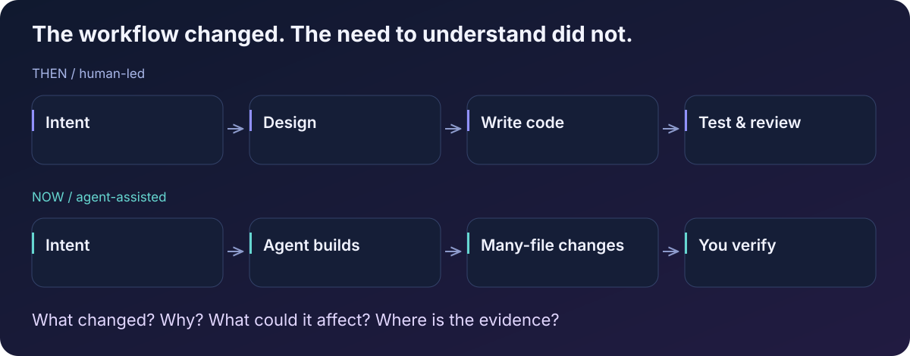
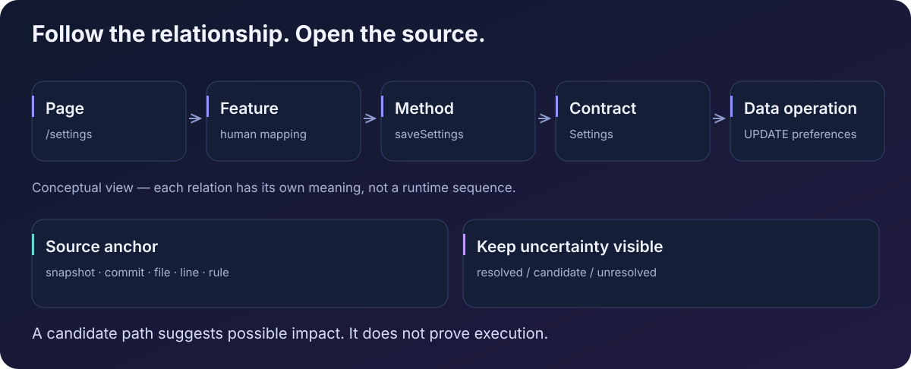
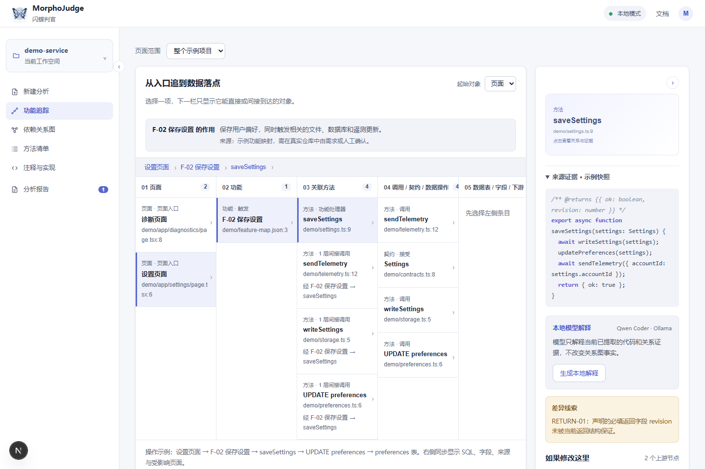
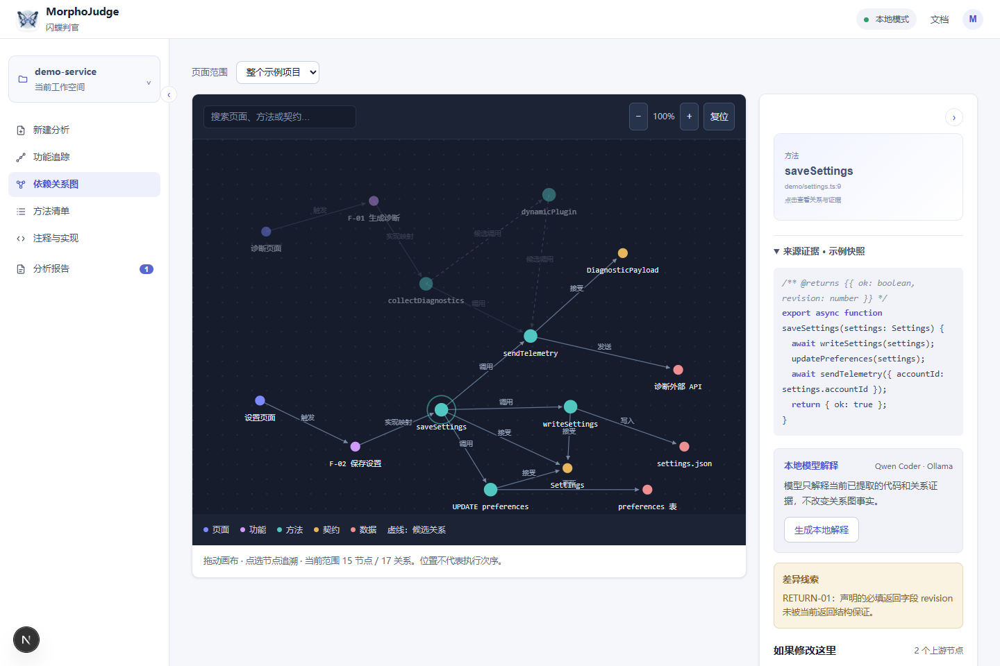
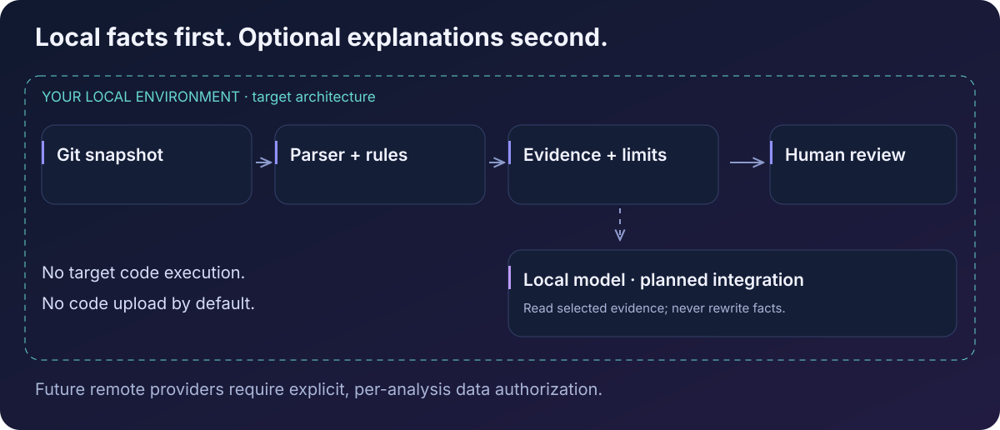

<p align="center">
  
</p>

# MorphoJudge · 闪蝶判官

**An AI-era software trust layer. Local first. Open source.**

**English** · [简体中文](README.zh-CN.md)



MorphoJudge is a local-first open-source AI software trust layer that helps developers understand, verify and trust AI-generated software.

> **Early development, not a finished security product.** You can run the Web prototype and the deterministic TypeScript/JavaScript analysis tests today. The Web still uses demonstration data; it is not connected to the real analysis engine. Model explanations in the prototype use a Fake Provider, not a live Ollama model.

## Why I started this

I use AI coding tools heavily: Codex, Claude Code, Zcode, Cursor, and other coding agents. They let me build things much faster.

They also changed my job. I used to design, write, test, and review the code. Now an agent can implement a request, touch dozens of files, introduce dependencies, and run the tests before I have understood the changes.

**The code runs. But do I actually understand what it does?**

AI is producing code faster than I can understand it. MorphoJudge started with that uncomfortable gap—not with a claim that another AI can simply certify the first one's work.



## Questions worth answering

- What changed, and where is the source behind each conclusion?
- How does a page or event connect to methods, contracts, and data operations?
- Could this change affect another page or a shared method?
- Which network, shell, file, permission, or dependency clues deserve a closer look?
- What was **not checked**, and what remains uncertain?

This is more than a list of review comments. The aim is to connect software structure, change evidence, and human understanding. A graph is one way in; the source and the limits of the analysis are what make the answer inspectable.



## Evidence before conclusions

| Layer | What it means |
| --- | --- |
| Code facts | Extracted syntax, locations, imports, and supported relationships |
| Deterministic rules | Reproducible observations with a rule and source evidence |
| Candidate relationships | Plausible links that must remain visibly uncertain |
| Unknowns and coverage | Unsupported constructs, failures, exclusions, and resource limits |
| Model explanations | Optional interpretations of selected evidence; never edits to the fact graph |
| Human review | Confirmation or dismissal of an individual finding, not a safety certificate |

“No finding” does not mean “safe.” A behavior clue does not prove execution. A possible impact path is not a runtime trace. Page-to-feature business meaning needs an explicit mapping or human confirmation.

## Explore the prototype

The screenshots below are **real captures of the current Chinese-language Web prototype using hand-authored demo data**. They illustrate the interaction, not analysis of a connected repository. The model controls visible in the screenshots are prototype UI; the current explanation endpoint uses a Fake Provider.

### Follow a feature into source



### Explore dependencies and possible impact



## What works today—and what does not

| Area | Current state |
| --- | --- |
| Local Git input | Snapshot identity, base/target diffs, file selection and coverage; Batch-01 independently reviewed |
| TS/JS understanding | Tree-sitter extraction, relationship IR, source locations and graph traversal; Batch-02 independently reviewed |
| Rules, evidence, impact | Batch-03 implementation and automated tests are present; **full independent batch acceptance remains pending** |
| Web workspace | Runnable prototype: feature tracing, graph, methods, source previews and demo reports; demo data |
| Local model integration | Fake explanation interaction exists; real Ollama integration remains planned |
| Persistence and real Web analysis | SQLite, analysis business API and Web-to-engine integration remain planned |
| End-to-end review and export | Not yet a completed, independently accepted production workflow |

Passing the included tests is evidence about those cases, not a general claim of correctness. The [PRD](docs/PRD.md) is the product baseline; [implementation milestones](docs/implementation-roadmap.md) describe the remaining work.

## Run it locally

You need **Git and Docker with Compose** (Docker Desktop using Linux containers, or Docker Engine + Compose). Project dependencies are installed in images, not on your host. First builds download base images and dependencies; this is distinct from uploading code or calling a model. The included fixture analysis does not need a model or execute the target's code.

```sh
git clone https://github.com/aiwindyjm/MorphoJudge.git
cd MorphoJudge

# Restore the two-commit synthetic Git fixture into a dedicated Docker volume.
docker compose --profile fixtures run --rm --build fixture-setup

# Start the prototype and local daemon.
docker compose up --build -d web daemon
```

Open **http://127.0.0.1:3017/** for the prototype. The daemon is not published to a host port; its health endpoint is not an analysis API.

```sh
# Run deterministic engine tests, including the real fixture analysis slice.
docker compose exec -T daemon pytest -q -o "addopts=-p no:cacheprovider"

# Check Web types.
docker compose exec -T web pnpm exec tsc --noEmit

# Run only the Git → rules → evidence → findings integration scenarios.
docker compose exec -T daemon pytest tests/test_analysis_slice.py -q
```

The analysis integration is currently a Python service exercised through tests—not a CLI or Web upload flow. The fixture initializer verifies a bundled Git history and checksum, requires no network, and refuses to overwrite a changed fixture. Details: [fixture distribution](tests/fixtures/distribution/README.md).

Port 3017 already in use? Set `MORPHOJUDGE_PORT` in your shell before starting Compose. To stop this project's services without removing its fixture volume:

```sh
docker compose down
```

## How the pieces fit



The engine uses **Python, FastAPI, Pydantic and Tree-sitter**; the prototype uses **Next.js, React and TypeScript**. Docker Compose defines the development environment. SQLite persistence and Ollama inference are planned parts of the next stages, not requirements already hidden behind the demo.

- **Local first:** no default code upload or telemetry; no execution of analyzed source, hooks or package scripts.
- **Evidence bounded:** models will receive only selected evidence from the current analysis. Model failure must not take away deterministic results.
- **Explicit remote boundary:** a future remote provider must require per-analysis consent showing the provider and data being sent.

See [architecture](docs/architecture.md), [technology choices](docs/tech-stack.md) and [the PRD](docs/PRD.md). These design documents are currently primarily in Chinese.

## Help build it

There is still a lot to learn: symbol resolution, dynamic behavior, accurate positions, small-model context limits, and useful explanations of what could not be determined.

Good contributions include:

- Small, public reproductions of a false positive, missed relationship, or wrong source location.
- Parser and rule improvements with positive, negative, and uncertain cases.
- Better coverage reporting and reproducible evaluation fixtures.
- Documentation, translations, and feedback on the existing interactions.

Start with the [contribution guide](CONTRIBUTING.md), [open problems](docs/open-problems.md), or a [GitHub issue](https://github.com/aiwindyjm/MorphoJudge/issues). Please include expected behavior, actual evidence, and a minimal sanitized example. Do not submit private code or real credentials.

```text
app/                     Web prototype and demonstration interactions
engine/morphojudge/       Git, selection, parsing, relationships, rules, evidence
engine/tests/            Deterministic and integration tests
packages/contracts/      Generated schema
tests/fixtures/          Reviewed fixture bundle and manifest
docs/                    PRD, architecture, implementation and contribution plans
assets/                  Original diagrams, brand artwork and real screenshots
```

## License

[MIT](LICENSE). Third-party dependencies, models, and assets retain their own licenses. The included diagrams are original project artwork; [asset provenance](assets/diagrams/README.md) identifies the logo and screenshots.
