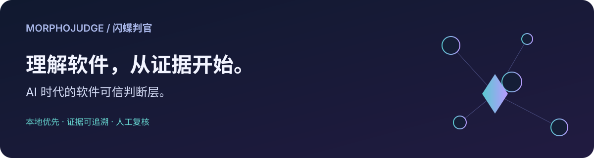
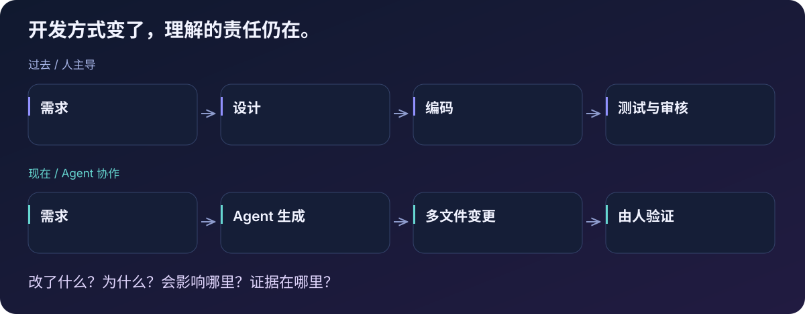
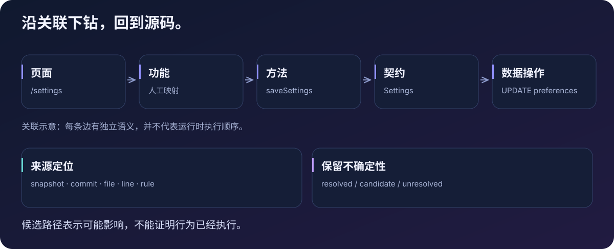
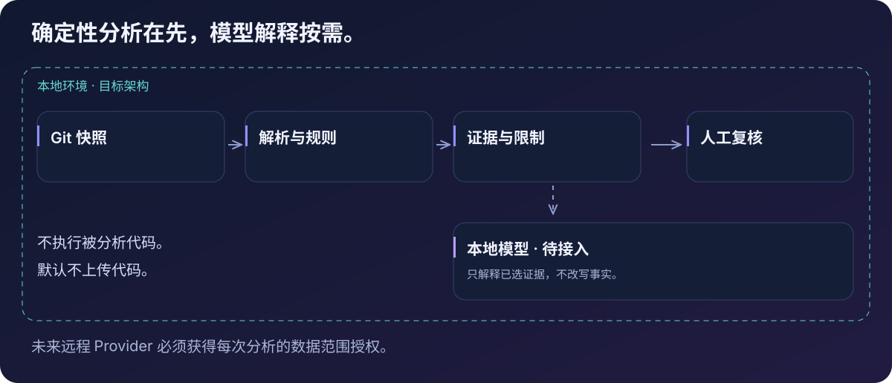

<p align="center">
  
</p>

# MorphoJudge · 闪蝶判官

**AI 时代的软件可信判断层。本地优先，开源共建。**

[English](README.md) · **简体中文**



MorphoJudge is a local-first open-source AI software trust layer that helps developers understand, verify and trust AI-generated software.

> **项目处于早期开发阶段，不是已经完成的安全产品。** 当前可以运行 Web 原型和 TypeScript/JavaScript 确定性分析测试。Web 仍使用演示数据，尚未连接真实分析引擎；原型模型解释使用 Fake Provider，并未接入真实 Ollama 模型。

## 为什么发起这个项目

我是一个重度 AI Coding 使用者。日常大量使用 Codex、Claude Code、Zcode、Cursor 和其他 AI Agent 开发工具。它们让我更快地把想法变成软件。

但我的工作也随之改变。过去，我设计、编码、测试，再审核。现在，Agent 可以实现需求、修改几十个文件、引入依赖、跑完测试，而我还没有理解这些改动。

**代码可以运行。但是，我真的理解它做了什么吗？**

AI 生成代码的速度，正在超过我理解代码的速度。MorphoJudge 从这个真实的困惑开始，而不是从“再用一个 AI 就能证明前一个 AI 正确”的承诺开始。



## 我们想回答的问题

- 这次到底改了什么，每条判断的源码依据在哪里？
- 一个页面或事件，如何关联方法、数据契约和数据操作？
- 修改这里，会不会影响其他页面或公共方法？
- 哪些网络、Shell、文件、权限或依赖线索值得进一步检查？
- 哪些内容**没有检查**，哪些关系仍然无法确定？

我们希望把软件结构、变更证据和人的理解联系起来，而不只是生成一批审查评论。关系图只是一个入口；能够回到源码，知道分析的边界，才让判断可被复核。



## 证据优先于结论

| 层级 | 表达什么 |
| --- | --- |
| 代码事实 | 提取到的语法、位置、导入及受支持的结构关系 |
| 确定性规则 | 可复现、带规则和来源证据的观察 |
| 候选关系 | 可能存在的关联，必须保留不确定性标记 |
| 未知与覆盖 | 未支持语法、失败、排除项和资源限制 |
| 模型解释 | 对已选证据的可选解释，不得改写事实图 |
| 人工复核 | 确认或驳回某条发现，不代表软件整体安全 |

“没有发现”不等于“安全”。行为线索不证明实际执行，可能影响路径不等于运行时调用轨迹。页面与功能的业务含义，需要显式映射或人工确认。

## 看看当前原型

下面是**当前中文 Web 原型的真实截图，使用人工编写的示例数据**。它们展示现有交互，不代表已连接用户仓库。截图中的模型控件属于原型界面，当前解释接口使用 Fake Provider。

### 从功能追到源码


### 查看依赖与可能影响


## 当前能做什么，还缺什么

| 领域 | 当前状态 |
| --- | --- |
| 本地 Git 输入 | 快照身份、base/target Diff、文件选择与覆盖；Batch-01 已独立验收 |
| TS/JS 软件理解 | Tree-sitter 提取、关系 IR、源码定位与图遍历；Batch-02 已独立验收 |
| 规则、证据与影响分析 | 已有 Batch-03 实现及自动化测试；**完整批次独立验收尚待完成** |
| Web 工作台 | 可运行的功能追踪、关系图、方法、源码预览与示例报告；使用演示数据 |
| 本地模型 | 已有 Fake 解释交互，真实 Ollama 接入仍在规划中 |
| 持久化与真实 Web 分析 | SQLite、分析业务 API、Web 与引擎联动仍待实现 |
| 端到端复核与导出 | 尚未形成完整、独立验收通过的生产工作流 |

测试通过只能证明对应场景，不能推广为任意软件的正确性保证。[PRD](docs/PRD.md) 是唯一产品需求基线，[实施里程碑](docs/implementation-roadmap.md) 记录后续工作。

## 本地运行

需要 **Git 和支持 Compose 的 Docker**：Docker Desktop 使用 Linux containers，或 Docker Engine + Compose。项目依赖安装在镜像里，宿主机无需另建 Node/Python 开发环境。首次构建需要下载基础镜像和依赖，这与上传代码或调用模型不同。示例确定性分析无需模型，也不会执行被分析代码。

```sh
git clone https://github.com/aiwindyjm/MorphoJudge.git
cd MorphoJudge

# 将含两个提交的脱敏 fixture 恢复到专用 Docker volume。
docker compose --profile fixtures run --rm --build fixture-setup

# 启动原型和本地 daemon。
docker compose up --build -d web daemon
```

打开 **http://127.0.0.1:3017/** 查看原型。daemon 不向宿主机开放端口，健康检查接口不是分析业务 API。

```sh
# 运行确定性引擎测试，包含真实 fixture 分析切片。
docker compose exec -T daemon pytest -q -o "addopts=-p no:cacheprovider"

# Web 类型检查。
docker compose exec -T web pnpm exec tsc --noEmit

# 单独运行 Git → 规则 → 证据 → 发现的集成场景。
docker compose exec -T daemon pytest tests/test_analysis_slice.py -q
```

当前真实分析入口是由测试调用的 Python 服务，不是已经完成的 CLI 或 Web 上传流程。fixture 初始化器校验 Git 历史与包摘要，运行时无网络，拒绝覆盖被修改的 fixture。详见 [fixture 分发说明](tests/fixtures/distribution/README.md)。

如果 3017 被占用，在 shell 设置 `MORPHOJUDGE_PORT` 后启动 Compose。停止本项目服务且保留 fixture 卷：

```sh
docker compose down
```

## 系统如何协作



引擎采用 **Python、FastAPI、Pydantic、Tree-sitter**；原型采用 **Next.js、React、TypeScript**；使用 Docker Compose 统一开发环境。SQLite 持久化与 Ollama 推理属于后续阶段，不是示例界面背后已经完成的功能。

- **本地优先**：默认不上传代码、不发送遥测，不执行被分析源码、hooks 或包脚本。
- **证据限定**：模型只接收当前分析允许的证据；模型失败不能使确定性结果失效。
- **远程边界明确**：未来使用远程 Provider，必须按次确认 Provider 和将要发送的数据范围。

设计细节见 [架构](docs/architecture.md)、[技术栈](docs/tech-stack.md) 与 [PRD](docs/PRD.md)。这些设计文档目前主要以中文维护。

## 一起建设

符号解析、动态行为、准确定位、小模型上下文、如何说明“无法判断”，都还有很多值得共同研究的问题。

欢迎从这些贡献开始：

- 可公开的最小复现：误报、漏掉的关系、错误的源码位置。
- 带正例、反例及不确定场景的解析器和规则改进。
- 覆盖范围说明、可复现的评估样例。
- 文档、翻译，以及对现有交互的反馈。

请先阅读[贡献入口](CONTRIBUTING.md)、[开放问题](docs/open-problems.md)，或提交 [GitHub Issue](https://github.com/aiwindyjm/MorphoJudge/issues)。说明预期、实际证据和最小脱敏示例，不上传私有代码或真实凭据。

```text
app/                     Web 原型与演示交互
engine/morphojudge/       Git、选择、解析、关系、规则与证据
engine/tests/            确定性与集成测试
packages/contracts/      生成的 Schema
tests/fixtures/          已检查的 fixture bundle 与 manifest
docs/                    PRD、架构、实施与贡献计划
assets/                  原创图解、品牌素材和真实截图
```

## 许可证

[MIT](LICENSE)。第三方依赖、模型与素材遵循各自许可证。图解为项目原创；Logo 与截图来源见[素材说明](assets/diagrams/README.md)。
