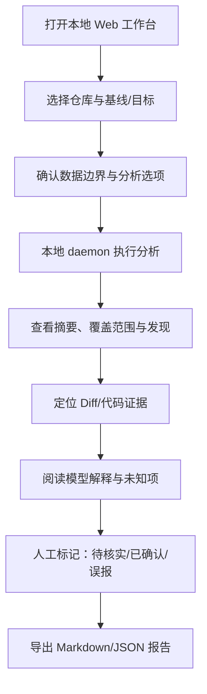

# MorphoJudge 产品需求文档（PRD）

版本：`0.23-draft`
状态：公开评审草案  
更新日期：2026-09-16
唯一产品需求基线：本文件。实现、Issue、架构和路线图必须与本文件联动；冲突时先记录冲突，不静默选择。

## 1. 产品目标

MorphoJudge 是一个 **Web 工作台 + 本地分析服务**，帮助开发者理解、验证和复核 AI Coding Agent 生成或修改的软件。它输出带证据和覆盖边界的审计报告，不证明软件绝对安全、不替代人工发布决策、不上传代码到云端。

### 1.1 目标用户

- 使用 Codex、Claude Code、Cursor、Zcode 等 Agent 的开发者。
- 需要审阅多文件变更的维护者、架构师和安全研究人员。
- 需要在代码受控环境内建立交付依据的企业团队。

### 1.2 成功标准（v0.1）

对一个公开的最小 TypeScript Web fixture 仓库（包含路由、页面事件、方法、API 契约、数据库操作和行为风险），用户能够：选择基线和目标、启动本地分析、看到变更/结构/行为/依赖发现、定位证据、按需阅读本地模型解释、标记人工复核状态，并导出 Markdown/JSON 报告。每条结论都能回到文件、行号、提交、规则或依赖证据；未检查、无法解析和资源受限范围必须单独列出。断网且不执行目标仓库代码时，确定性基础流程仍可完成。

## 2. 产品边界

### 包含

1. Git 基线与目标的显式比较。
2. 新增、修改、删除、重命名文件和 Diff 展示。
3. 支持范围内的项目结构、模块关系和调用线索。
4. 网络、外部 API、Shell、文件操作和权限相关行为线索。
5. 依赖清单、锁文件、版本与来源变化。
6. 本地模型对已提取证据的解释、关注项和未知项。
7. 本地保存、浏览、复核和导出报告。

### 不包含

云端代码上传、默认遥测、SaaS 多租户、自动修复、自动部署、生产批准、完整漏洞证明、全语言支持、完整跨语言知识图谱和目标仓库代码执行。

## 3. 用户流程



### 3.1 创建分析

用户必须提供仓库路径、基线引用和目标引用；选项包括是否分析依赖、是否调用已配置的本地模型和报告输出位置。界面在开始前显示：本地监听地址、是否会访问远程端点、预计覆盖范围和不执行仓库代码的约束。

### 3.2 分析状态

状态枚举：`queued`、`running`、`completed`、`completed_with_limits`、`failed`、`cancelled`。确定性阶段至少包括 `git`、`parse`、`behavior`、`dependency`、`report`；`explain` 是分析完成后的独立可选任务，不决定基础分析是否完成。失败必须包含原因、恢复建议和已完成阶段；部分成功不得伪装成完整扫描。

### 3.3 报告页面

报告按“变更摘要 → 高影响关注项 → 证据 → 模型解释 → 人工复核 → 覆盖限制”组织。用户可以按文件、类别、状态和证据可靠程度筛选，点击发现跳转到新旧代码位置。报告必须同时展示“未发现”和“未检查/无法判断”的区别。

### 3.4 人工复核

复核状态：`unreviewed`、`needs-investigation`、`confirmed`、`dismissed`。备注只保存本地；状态变更记录时间和分析版本。`confirmed` 表示人工确认该发现描述成立，不表示软件整体安全。

## 4. v0.1 功能需求

| ID | 功能 | 必须满足 |
| --- | --- | --- |
| FR-001 | Git 变化 | 显示基线/目标、文件状态、Diff；重命名、二进制、子模块、LFS 和未跟踪文件的支持边界明确显示 |
| FR-002 | 结构理解 | 输出文件树、模块/导入关系和支持范围内调用线索；每条关系可定位或标为推断 |
| FR-003 | 行为分析 | 发现网络、外部 API、Shell、文件、权限线索；区分基线已有与本次新增 |
| FR-004 | 依赖分析 | 比较清单/锁文件，显示新增包、版本、来源和未检查的漏洞情报状态 |
| FR-005 | 本地解释 | 模型只能解释已存在证据；返回结构化结果，无法引用证据则降级为未知/失败 |
| FR-006 | 证据链 | 发现包含分析器版本、文件、旧/新位置、提交、代码片段和规则理由 |
| FR-007 | 报告导出 | 导出 Markdown 和 JSON；包含分析范围、发现、复核状态、覆盖限制和运行环境 |
| FR-008 | 本地边界 | 默认无网络代码外发、不执行目标代码、不接受任意命令；远程端点需显式配置 |
| FR-009 | 失败可见 | 解析失败、超大文件、未知语言、模型不可用和资源不足进入报告 |
| FR-010 | 可复现 | 相同 fixture、提交、规则和模型配置可重跑并比较结果 |
| FR-011 | 软件关系地图 | 页面、功能、方法、契约、数据/外部服务的有向关系；节点和边均有来源；支持筛选、点选和反向影响追踪 |
| FR-012 | 注释与实现一致性 | 对参数、返回契约、显式副作用声明进行规则检查；并排展示声明和实现证据；未知项不得判为一致 |
| FR-013 | 功能追溯 | 页面事件经方法、契约到数据的对应表；业务功能来自显式需求映射或人工确认，名称推测不作为事实 |

## 5. 非功能需求

- **隐私**：源码、报告、缓存和日志默认留在本机；不记录密钥、令牌、Cookie 或完整私有代码。
- **安全**：仓库内容和模型输出不具备指令权限；路径和符号链接受边界检查；分析器不安装依赖、不运行 hooks/脚本。
- **可解释**：事实、规则提示、模型假设、人工确认分层；不使用未经校准的单一可信分数。
- **可用性**：模型缺失时仍输出基础分析；前端清晰展示运行状态、错误和覆盖限制。
- **可维护性**：规则、证据 schema、模型 Provider 和报告渲染相互隔离；首个语言确定后再实现。

## 6. 技术栈基线

| 层 | 基线 |
| --- | --- |
| Web | Next.js 16 App Router、React、TypeScript strict |
| UI | Tailwind CSS、shadcn/ui |
| 本地服务 | Python 3.12、FastAPI、Pydantic |
| 解析与分析 | Tree-sitter、Python 确定性规则引擎 |
| Git | 受限只读 Git 调用或 libgit2 绑定 |
| 存储 | 本地 SQLite、JSON/Markdown 导出 |
| 模型 | Provider 接口；首个运行时优先验证 Ollama，后续评估 llama.cpp/vLLM |
| 测试 | Vitest、pytest、Playwright；fixture/fake provider，不调用真实模型 |
| 工具 | pnpm、uv、Ruff、mypy、ESLint、Prettier |
| 开发与构建 | Docker Linux containers + Docker Compose；Node 22、pnpm 10.30.3；镜像摘要与 pnpm-lock.yaml 锁定构建输入 |

技术栈选择理由、进程边界和未来重评条件见 [tech-stack.md](tech-stack.md)。若本文件与该文档冲突，以本文件为准，并在同一版本更新另一文档。

### 6.1 Docker 开发与交付约定

- Docker Compose 是统一工程入口；当前只有 Web 原型，不启动不存在的分析服务、数据库或模型服务。
- `web` 为热更新开发服务，`preview` 为生产构建预览服务。Compose 项目名固定为 `morphojudge`，与其他本地项目隔离；不固定容器名，不使用 host 网络或特权模式。
- 开发服务在容器中安装 Linux 依赖，只有 `app/` 和 `public/` 只读挂载并通过轮询触发更新；宿主机不安装 Node/pnpm。配置或依赖变化后重建容器，避免混用 Windows node_modules 或旧依赖卷。
- 默认开发地址 `http://127.0.0.1:3017`，生产构建预览地址 `http://127.0.0.1:3018`；可分别通过 `MORPHOJUDGE_PORT`、`MORPHOJUDGE_PREVIEW_PORT` 改端口。容器内监听 `0.0.0.0:3000`，宿主机仅发布回环端口。
- Dockerfile 使用依赖、开发、构建、运行分阶段。生产镜像运行 Next.js standalone 输出，不挂载宿主源码；开发与运行进程均使用非 root 用户，关闭 Next.js 遥测。
- `.dockerignore` 采用应用文件白名单；`PRIVATE/`、聊天记录、Git 历史、凭据、报告和模型权重不进入构建上下文。构建禁止使用 `COPY . .` 或将整个工作区挂载到 Web 容器。
- 首次拉取镜像/安装依赖需要网络；镜像准备完成后的原型运行不依赖云端 API。容器网络不是自动断网隔离，Local First 也不代表所有出网已被阻止。
- 后续 FastAPI 容器只通过 Compose 内网提供服务，由同源 Web API 代理转发；浏览器不能解析 Compose 服务名，也不能用自身 localhost 直接代表容器。目标仓库显式只读挂载到分析容器，界面使用仓库注册 ID 映射容器路径，不透传任意宿主绝对路径。
- 后续 SQLite/报告使用分析容器独立持久卷，模型使用独立服务/显式端点，均不烘焙进镜像。本次不预建这些服务；删除持久卷需单独授权，日常停止使用 `docker compose --profile preview down`，不加 `--volumes`。

验收：开发及生产预览镜像构建成功；健康检查通过；开发源码变更热更新；类型检查通过；镜像无私有目录；服务端口仅回环发布。该验收不代表原型已经连接分析器或模型。

当前验证记录（2026-09-12）：上述 Docker 验收已通过，Web 开发与生产预览均返回 HTTP 200；不包含浏览器交互自动化验收。依赖安装提示现有 Next.js 16.0.0 存在已知安全问题，后续发布前需升级并回归；当前容器仅用于本机原型评审，未宣称达到生产发布要求。

## 7. 统一语义

| 术语 | 定义 |
| --- | --- |
| 变更（Change） | 基线与目标之间的可观察差异；不等于用户意图 |
| 基线（Base） | 比较使用的旧提交或快照 |
| 目标（Target） | 比较使用的新提交或快照 |
| 证据（Evidence） | 可定位到提交、文件、位置、规则或依赖记录的事实材料 |
| 发现（Finding） | 由证据支持的事实、规则提示或模型假设；不是漏洞定论 |
| 行为线索（Behavior signal） | 静态代码中可能产生网络、Shell、文件或权限行为的可定位线索 |
| 覆盖限制（Coverage limit） | 因语言、文件、动态行为、资源或缺失情报导致未检查或无法判断的范围 |
| 模型解释（Model explanation） | 对已有证据的本地模型归纳；必须标明推测和引用 |
| 人工复核（Human review） | 人对单条发现描述的确认、驳回或待调查，不是整体安全认证 |
| 可信报告（Trust report） | 汇总范围、证据、发现、解释、复核状态和未知项的可导出结果 |
| 本地优先（Local First） | 默认数据处理与推理在本机或明确配置的内部环境完成 |
| 未检查（Not checked） | 工具没有足够数据或能力进行判断；不能写成“安全” |

术语要求：使用“发现”而非“漏洞”描述静态结果；使用“线索”而非“已执行行为”；使用“模型假设”而非“AI 结论”；使用“未检查”而非“无风险”。

## 8. 数据对象草案

```text
Analysis { id, repository, base, target, status, stages, tool_versions, limits }
Finding { id, category, status, impact, reliability, evidence_ids, explanation_id? }
Evidence { id, source, commit, path, side, start, end, snippet, rule_id }
Explanation { id, provider, model, claims, evidence_ids, uncertainty, errors? }
Review { finding_id, state, note, updated_at }
```

字段契约在 MJ-004 中正式定稿；此处定义语义和必备关系，不代表已实现 API。

## 9. 版本与变更管理

本 PRD 采用 `major.minor-status`：`0.1-draft` 表示首个 MVP 的公开草案。以下变化必须更新版本、日期和变更记录：产品边界、必需功能、数据边界、技术栈基线、术语定义、验收条件。

对话和浏览器评审中确定的功能、命名、UI 与交互细节须在同一次任务中归入本文件对应章节，更新版本及变更记录；非必要不新增文档。明确要求直接同步，未确认提议标为待讨论；需求、实现状态、验证结果分别维护。遇到与现有基线或已确认决定冲突时，记录具体条目、影响和选项，暂停冲突部分另行讨论，无冲突部分继续。每次交付前检查反馈与 PRD 的对应关系，私有会话记录只承担协作追溯。

### 变更记录

| 版本 | 日期 | 变化 |
| --- | --- | --- |
| 0.1-draft | 2026-09-12 | 首次建立功能设计、技术栈基线、统一语义和验收边界 |
| 0.2-draft | 2026-09-12 | 保留 Web 原型交互规格，新增 Docker 统一开发/构建、端口、挂载、依赖锁定及后续容器通信边界 |
| 0.3-draft | 2026-09-12 | 将无模型的软件关系地图、功能追溯、注释/契约一致性检查纳入核心设计；新增交互原型与算法边界 |
| 0.4-draft | 2026-09-12 | 面向任务重命名代码导览与四个视图，解释版本对比方向；统一全局响应式、触屏导航及功能说明 |
| 0.5-draft | 2026-09-12 | 纳入方法文件定位、悬停/焦点代码预览、触屏交互和全局源码高亮要求；区分局部实现与待验收范围；明确后续反馈同步及冲突讨论规则 |
| 0.6-draft | 2026-09-13 | 按七项布局评审调整为固定视口工作台：顶部工作空间、左右可收起/停靠导航与工具、局部滚动、选中对象与下钻路径联动；替代 0.4 中屏详情下移的长页布局 |
| 0.7-draft | 2026-09-13 | 根据用户视角重排入口和空间：工作空间置于顶栏，移除重复项和大块宣传占位；左栏可收起，右侧详情工具栏可展开，视图保持单页上下文与局部滚动 |
| 0.8-draft | 2026-09-13 | 根据用户明确纠正，工作空间回归左栏顶部；四个导览视图归入左栏，报告排在导航最后；移除“追踪一次改动”标题及重复项目名称，窄屏用同一导航抽屉 |
| 0.9-draft | 2026-09-13 | 引入可翻转对象卡：在右侧详情中快速查看方法/契约/行为对象摘要，翻转到上下游与证据提示；支持点击、键盘和触屏语义，不以动效替代必要信息 |
| 0.10-draft | 2026-09-13 | 修正工作栏样式漂移并固化视觉回归约束：导航图标、名称与数量徽标使用独立语义类；折叠态仅显示图标；桌面、平板、手机分别采用停靠右栏、右侧覆盖面板和底部详情面板 |
| 0.11-draft | 2026-09-13 | 按用户反馈精简中央工作区：删除“规则计算 · 无 AI 调用”徽标与常驻视图用途段落，工具栏只保留页面范围筛选；左右面板收起/展开统一为 24px 圆形箭头钮（含折叠轨边缘常驻钮、宽度过渡与 reduced-motion 降级），右侧详情收起后中央占满宽度并按断点提供固定圆形恢复入口 |
| 0.12-draft | 2026-09-13 | 经 app-ui-ux-best-practices 技能评估（Convention Track，Linear 式“聚焦判官席”方向，用户三选一确认）引入全站设计令牌系统：CSS 变量统一色彩/圆角/阴影/动效层级；正文从 9–11px 提升到 12/13/14px 阶梯并补 tabular-nums；为导航、按钮、发现卡、表格行补齐 hover/active/focus-visible 状态；语义色与文本对比度 ≥ 4.5:1；浅色上下文语法高亮修正；reduced-motion 全局降级 |
| 0.13-draft | 2026-09-14 | 按用户要求引入品牌 logo（用户提供 2048px 原图）：顶栏品牌标记由 ✦ 字形改为 logo 图片（96px@2x 渲染 32px），新增 `app/icon.png` 浏览器 favicon；源图归档 `assets/logo/logo-source-2048.png`。技能评估结论与使用边界见 §11.8 |
| 0.14-draft | 2026-09-14 | 落实 §11.8 图标后续项：新增 `app/icons.tsx` 统一线性 SVG 图标集（24px 网格、1.75px 描边、currentColor），替换导航、工作空间/路径、提示、发现分类、导出与模型解释的文本字形；运行态等待图形改用品牌 logo 脉动；`.folder` 散落色值并入令牌 |
| 0.15-draft | 2026-09-14 | 按用户反馈删除新建分析页全部说明性内容：宣传 eyebrow/大标题/导语、两个版本选择器的帮助小字、对比说明条与示例提示框（本地/示例边界由左栏“示例模式”状态与覆盖说明承载）；同步清理死 CSS 与未用 info 图标 |
| 0.16-draft | 2026-09-15 | 调研 Alibaba OpenCodeReview（Apache-2.0）并纳入可借鉴架构：确定性文件选择与规则匹配、语义分组、代理工具受限上下文、行级定位/反射、可恢复会话与结构化覆盖清单；明确与 MorphoJudge Local First 边界的差异和移植优先级 |
| 0.17-draft | 2026-09-15 | 根据部署实测确认当前工作台存在信息架构过载、入口顺序不清、五栏与详情并列造成认知负担等问题；补充 OpenCodeReview、Semgrep、CodeQL、Joern、reviewdog 的确定性工作流借鉴，提出“分析快照 → 覆盖 → 结果 → 证据 → 复核”的阶段式工作台重构和可验收状态契约 |
| 0.18-draft | 2026-09-15 | 根据用户复核结论，撤销将 Alibaba OpenCodeReview 作为 MorphoJudge 借鉴来源的决定；保留事实调研作为历史记录，确定性分析基线仅参考与本项目理念一致的通用方法和其他相似项目，并明确不得从 OpenCodeReview 移植界面、流程或实现 |
| 0.19-draft | 2026-09-15 | 补充本地大语言模型闭环：在当前右侧详情中按需生成证据解释、方法作用归纳和未知项说明；模型结果必须引用现有证据并与确定性关系分层；增加 Provider 状态、失败重试和远程模型按次授权边界；原型新增 `/api/explanations` 本地 Fake Provider 适配 |
| 0.20-draft | 2026-09-15 | 锁定产品闭环边界：页面→功能语义以代码事实为基础并需人工确认；v0.1 首个真实 fixture 必须覆盖 TypeScript 路由、页面事件、方法、API 契约、数据库操作和行为风险；可信承诺限定为逐条可追溯与未检查范围透明；模型解释从分析完成状态中独立出来 |
| 0.21-draft | 2026-09-16 | 将实施方式确定为“ZCODE 按 Batch 一次性施工并停止 → Codex 独立审计 → 通过后进入下一 Batch”；补充批次状态、交付回执、停止门禁和任务映射，清理路线图中的未定义任务编号 |
| 0.22-draft | 2026-09-16 | 根据实施可行性审计，将路线调整为 7 个可运行 Batch：首批包含 Docker daemon 骨架、TypeScript fixture、Git Snapshot、Diff 与 Coverage；修正任务依赖和未定义编号，确立批次交付后必须停止并等待 Codex 审计 |
| 0.23-draft | 2026-09-16 | 按用户反馈改为完整能力闭环交付：Task ID 仅作批次内部追溯，取消逐 Task 人工交接；施工前集中确定边界矩阵，批次内持续实现与自测，交付后独立验收；返工按根因一次性处理，按变更范围复核，避免重复全局扫描 |
| 0.21-draft | 2026-09-15 | 新增可执行实施文档体系：总体策略、版本路线图、任务规格、架构决策、契约冻结、Coding AI 协议和 Codex A0-A7 独立验收；明确真实纵向闭环优先于孤立模块交付 |

## 10. 联动索引

- [vision.md](vision.md)：愿景与长期边界；不能替代本 PRD 的功能要求。
- [problem.md](problem.md)：问题证据与场景；不能证明功能已实现。
- [architecture.md](architecture.md)：系统分层与安全边界；实现必须符合本 PRD。
- [tech-stack.md](tech-stack.md)：本 PRD 的技术选型说明与重评条件。
- [roadmap.md](roadmap.md)：按本 PRD 拆分阶段交付。
- [issues.md](issues.md)：将需求拆成可验收任务。
- [implementation-strategy.md](implementation-strategy.md)：分层、数据流、安全边界和纵向闭环施工图。
- [implementation-roadmap.md](implementation-roadmap.md)：按里程碑定义发布门槛。
- [implementation-tasks.md](implementation-tasks.md)：Coding AI 可逐项执行的任务规格。
- [architecture-decisions.md](architecture-decisions.md)：已确认架构决策和变更入口。
- [contract-freezes.md](contract-freezes.md)：数据、API、Evidence 和状态冻结点。
- [coding-agent-protocol.md](coding-agent-protocol.md)：Coding AI 领取、实现、测试和交付协议。
- [codex-acceptance.md](codex-acceptance.md)：Codex 独立验收等级与命令。
- [implementation-tasks.md](implementation-tasks.md) 中的 Batch 映射：ZCODE 批次施工和 Codex 阻断式验收入口。

实施节奏：ZCODE 每次只执行一个 Batch，完成后提交批次回执并停止；Codex 根据 [codex-acceptance.md](codex-acceptance.md) 独立审计，只有标记 `PASSED` 后才可执行下一 Batch。批次任务、顺序和门槛以 [implementation-roadmap.md](implementation-roadmap.md) 为准。

### 10.1 完整能力交付与协作成本（0.23）

- 用户交接单位是能复现的完整能力闭环，Task ID 用于追溯和内部检查，不是逐项等待用户或 Codex 的门禁。ZCODE 在同一 Batch 内按依赖连续实现、集成、自测、修复，直到满足批次完成定义才交付。
- 施工前在既有批次规格中集中列出输入、产物、修改范围，以及正常、反例、边界、失败和安全场景。不能仅针对给定 fixture 或审计反例打补丁，也不能承诺有限测试证明所有输入正确。
- 批次内允许维护必要的内部解析结构和函数、处理关联缺陷；不因此扩大产品范围、重构已确认 UI 或绕过冻结契约。真正的需求冲突、破坏性契约变更及不可恢复的环境阻塞仍须如实报告，无冲突工作继续。
- Codex 在批次交付后进行一次集中独立验收：基于本次变更、结果和受影响边界选择检查，统一返回根因清单；已通过且没有受影响的内容不重复人工全量审阅。最终自动回归可以覆盖全套，不等于每次人工扫描全仓库。
- 修复轮次针对全部已知根因及同类场景一次完成。新增验收要求必须区分“违反既有要求的缺陷”和“新能力建议”；后者进入后续计划，不临时扩大放行门槛。新发现的真实证据错误、安全边界或契约问题仍可阻塞，节省协作成本不等于放弃独立验收。
- 需求、实现状态、验证记录分开。过程更新简短，交付附可定位的代码、测试与原始输出；不粘贴冗长施工流水账。下一批次只有前一批次获 Codex `PASSED` 后才启动。

PRD 与代码、测试、Issue 或路线图不一致时，优先修正文档联动关系，再实现功能。

## 11. Web 原型交互规格

原型位于仓库根目录 `app/`，使用假数据和本地 React 状态模拟完整流程；它不是已连接的 daemon。原型的视觉和交互是后续 API 实现的界面基线。

### 11.1 页面与导航

| 页面/状态 | 用户目的 | 关键交互 |
| --- | --- | --- |
| 新建分析 | 选择仓库、基线、目标和分析选项 | 路径选择、提交校验、Local First 提示、开始分析 |
| 分析中 | 了解任务阶段和安全边界 | 阶段进度、失败/取消状态预留；不可误显示为完成 |
| 分析报告 | 复核变更和发现 | 摘要指标、类别筛选、发现列表、证据详情、代码定位 |
| 人工复核 | 对单条发现做判断 | `需调查`、`已确认`、`误报` 状态按钮与本地备注预留 |
| 导出报告 | 保存可复核结果 | Markdown/JSON 导出入口；实际导出由 daemon API 实现 |

### 11.2 交互原则

- 真实分析主操作为“开始本地分析”，示例原型为“预览分析流程”；危险或不可逆操作不放在主流程。
- 所有状态使用明确文字：`进行中`、`已完成`、`需调查`、`未检查`，不只依赖颜色。
- 发现列表与证据详情保持联动；筛选不改变原始发现数量，只改变可见项。
- 证据详情先展示事实，再展示模型解释；模型解释显示模型和运行时，并链接证据 ID。
- 人工状态只作用于当前发现；不出现“整体安全”“自动批准”等措辞。
- 移动端收窄为单列，主入口保持可访问；具体断点和交互见 §11.3。

### 11.3 易读命名与响应式规范（0.4）

| 界面名称 | 用户可立即理解的用途 | 原型原名 |
| --- | --- | --- |
| 代码导览 | 看懂功能如何实现，以及改动可能影响哪里 | 软件地图 |
| 功能追踪 | 从页面或方法逐层查看实现与数据落点 | 多栏联动 |
| 依赖关系图 | 从全局网络查看连接与上下游依赖 | 宏观网络 |
| 方法清单 | 按表格对照方法、页面功能、契约和调用 | 对应关系 |
| 注释与实现 | 对照声明与实现事实，查看规则发现的差异 | 一致性检查 |

视图不常驻用途说明（0.11 按用户决定移除），不使用占用大块画布的宣传标题。功能作用说明需要显式需求映射或人工确认来源，原型标注为人工示例。技术术语仍保留在证据中，不能为了易读丢失调用、契约与候选关系的区别。

新建分析使用“对比起点（修改前）”与“检查版本（修改后）”，说明方向 `旧提交 → 新提交`；显示分支名与提交短标识。HEAD 语义为当前检出的提交、不等于未提交的本地文件，该解释保留在本文档与选项文案，页面不再常驻帮助文字（0.15 移除表单帮助、对比说明与示例提示框；本地/示例边界由左栏“示例模式”状态承载）。原型只有固定示例选择，按钮为“预览分析流程”，不暗示已经读取仓库。内部 Base/Target 语义不变。

响应式采用 §11.6 的固定视口与面板规则，替代 0.4 中屏详情下移和移动横向主导航。640px 及以下表单和声明对照单列，功能追踪按层折叠，选择条目自动展开下一层，上游重选清空后续旧路径。图和方法表允许容器内横向浏览，内容必须在可滚动区域中可达，不通过隐藏溢出掩盖截断。

验收覆盖 320、390、768、1207、1700px：主要导航和版本说明可见，选择与筛选仍工作，触屏可展开路径，各页面无文档级横向滚动。图像布局、详情和代码片段不得挤压主要操作。原常驻“视图用途”说明段落于 0.11 按用户决定移除，不再作为可见性验收项。

### 11.4 方法代码预览与快速识别（0.5）

面向开发者，方法入口必须让用户快速确认“哪个文件中的哪个方法、代码写了什么”。该要求覆盖方法清单、功能追踪、依赖关系图与影响路径中的方法入口；所有源码展示共用代码呈现能力，不依赖 AI。

- 方法清单常驻显示方法名称、文件路径与来源行号。悬停方法或键盘聚焦时显示代码预览；预览同时标明文件、行号和代码片段。片段不完整时说明截断，不暗示完整文件或完整方法。
- 点击方法保留完整证据与关系定位入口，可核对方法所属文件、源码及上下游影响；不能只跳到图而让用户找不到对应证据。切换方法时同步来源，不混用上一方法片段。
- 触屏不能依赖悬停：需提供可点击的预览入口及明确的完整证据操作。窄屏预览可用底部浮层，保留关闭方式，不遮挡必要操作。键盘聚焦可预览，Escape 可关闭；浮层不应因鼠标移入代码区域立即消失。
- 软件中的源码片段统一支持语法高亮，至少区分关键字、字符串与注释；以等宽字体显示，保留缩进、换行和可复制文本，结合文件/方法/行号快速识别。结构化事实按 JSON 呈现，不能冒充原始源码。
- 高亮只增强阅读，不代表语义解析、执行结果或安全判断。未知语言降级为纯文本；源码始终作为文本显示，不能执行 HTML 或仓库内容。代码解析与真实文件跳转的能力边界必须如实标注。

当前实现：方法清单已有鼠标悬停及焦点预览，显示文件和起始行；点击仍选择同一节点并切到依赖关系图，详情区显示该来源。方法清单预览和节点源码证据使用简单规则高亮；手机预览采用底部定位。仍为示例片段，未提供真实仓库完整文件导航。

待补齐：其他方法入口的统一预览、报告源码与结构化事实的高亮、按语言识别及健壮分词、明确的触屏预览/关闭与 Escape 行为、点击后证据可见性。上一轮仅通过类型检查和构建，尚未进行预览悬停、边缘裁切、键盘及触屏浏览器验收；不能将当前局部实现称为全软件已完成。

验收要求：同名异文件方法可由路径区分；预览代码与点击证据来自同一节点；切换不残留旧内容；注释与字符串中的关键字不被错误重复高亮；长代码、未知语言与包含 HTML 字符的源码可安全阅读；桌面悬停、键盘聚焦/关闭、手机点击/关闭均可操作；滚动、屏幕边缘和窄屏下不裁切必要信息、不产生页面级横向溢出。

### 11.5 关系对象翻转卡（0.9）

右侧详情区为当前选中对象提供翻转卡。正面显示类型、名称、文件/行号和“查看关系与证据”提示；点击或键盘 Enter/Space 翻转到背面，显示上下游数量、可追溯范围与证据入口；再次操作返回正面。方法、契约、数据和行为线索共用该模式。翻转只是空间压缩和上下文提示，完整代码、来源和影响始终可访问。

动效使用 CSS 3D 翻转，尊重 `prefers-reduced-motion`；触屏提供明确按钮语义，不能依赖 hover。卡片正反面文本均进入可访问名称，焦点不会因翻转丢失；窄屏卡片不遮住关闭工具栏与主要关系操作。对象变更时卡片回到正面，避免残留上一对象摘要。原型已在右侧方法详情实现基础版本，完整证据仍位于卡片下方。

### 11.5 原型到产品的替换点

原型的 `seed` 发现数据替换为 `GET /v1/analyses/{id}/findings`；开始按钮替换为 `POST /v1/analyses`；进度替换为分析状态轮询；复核按钮替换为 `POST /v1/analyses/{id}/review`；导出按钮替换为报告下载接口。页面组件不应承担 Git、解析、模型或 SQLite 逻辑。

### 11.6 单屏联动工作台（0.8）

- 左栏自上而下：工作空间 → 新建分析 → 代码导览分组（功能追踪、依赖关系图、方法清单、注释与实现）→ 分析报告。报告为最后一个导航项。工作空间只在左栏顶部出现，顶栏不再重复。该纠正由用户明确提出，替代 0.7 的位置定义；原型只有 demo-service，切换入口说明当前仅有示例而不虚构其他仓库。
- 四个视图共用左栏导航与激活状态，中间不再重复横向标签。点击视图直接进入对应内容；跨主导航返回仍记住导览视图和所选节点。移除“代码导览 · DEMO-SERVICE / 追踪一次改动”展示区，中间从页面范围筛选开始，不增加替代宣传标题；原“规则计算 · 无 AI 调用”徽标与常驻视图用途段落于 0.11 按用户决定删除，无 AI 调用与示例来源边界仍由覆盖说明承载。
- 顶栏约 48–56px，只保留品牌、模式和导航操作。左栏可收起并恢复；滚动内容时左侧入口保持可访问。窄屏通过顶栏按钮打开同一左栏，选择入口后关闭，支持关闭按钮与 Escape，不丢失工作空间和四个视图入口。取消停靠及对象索引仍为后续工作台要求，不能把本轮导航调整视为已交付所有面板功能。
- 中央区域使用剩余视口，视图标题、筛选和当前对象保持可见。各视图是同一关系快照的观察方式；选择方法在原视图打开右侧代码，不强制跳图。图定位作为显式操作。切换视图或主导航返回时保留选中对象、范围和功能追踪路径；提供对象浏览的后退/前进。
- 右侧始终保留紧凑工具条，分别打开代码证据、变更影响、直接/下游关系、覆盖说明；再次点击可收起，关闭后保留选择。宽屏可停靠并与中央分别滚动，取消停靠或窄屏时覆盖在画布上，关闭后回到原位置。上下游对象可直接继续选择；跨范围选择需同步范围，不能呈现不可见的已选节点而无提示。
- 固定视口内按区域滚动：左栏对象索引、中间列表/网络/追踪、右侧详情各自滚动，不再把全部详情和检查结果接成纵向长页面。功能追踪的路径始终位于浏览区顶部；横向下钻自动将后续栏带入视野，移动端逐层展开。关系路径和回退保留上下文，不要求用户记住前一对象。
- 大标题和整行示例警告改为紧凑的“示例 · 未接入仓库”状态入口，点击打开覆盖说明；仍保留无 AI 调用、示例来源和未解析边界。不得因压缩布局而隐藏事实边界。中央工作区直接进入对象浏览，不使用无法操作的宣传留白。
- 验收：在 1136×1066、1440×900、768×1024、390×844 与 320×640 下没有文档级横向溢出；代码、表格末行、完整影响与覆盖说明可在面板内访问；滚动时视图导航和所选对象可见。验证左右栏停靠/恢复、深层切换视图保留路径、方法表点击原地更新代码、关系继续下钻与回退、窄屏抽屉关闭恢复、项目入口和搜索空结果。长内容允许在对应面板内部滚动，不以整页堆叠替代联动。

### 11.7 导航样式隔离与跨断点详情面板（0.10）

- 工作栏导航的图标、名称和数量分别使用 `nav-icon`、`nav-label`、`nav-count` 语义样式。数量徽标样式不得通过元素选择器作用于名称；新增导航项必须沿用同一结构，避免全局选择器导致名称变成徽标、错位或竖排。
- 展开态中图标与名称保持相邻、单行且可扫描，报告数量靠右。约 58px 的桌面折叠态只保留居中的图标并通过可访问名称说明用途，不显示名称或数量；收起与展开共用折叠轨右缘的同一圆形箭头钮，不挤占内容布局。
- 901px 及以上右侧详情与中央内容并排停靠；641–900px 详情从右侧覆盖并独立滚动；640px 及以下详情作为不超过 54vh 的底部面板显示并独立滚动。左右面板的收起/展开均使用 24px 圆形箭头钮并带宽度过渡（尊重 `prefers-reduced-motion`）；右侧详情收起后中央占满宽度，桌面在内容右缘、平板在覆盖层右上、手机在底部面板右下提供固定圆形恢复入口。选择对象、当前视图和下钻路径不丢失。
- 视觉回归验收除 §11.6 的视口外，必须检查：名称背景透明且未继承数量徽标样式；展开态名称紧邻图标；折叠轨宽约 58px 且无竖排残留文字；1136px 右栏可见；768px 右侧面板不扩展文档高度；390px 底部面板位于视口内；各宽度 `scrollWidth <= clientWidth`。

### 11.8 设计令牌与视觉系统（0.12）

经 app-ui-ux-best-practices 评估，产品定类为效用型开发者工具（Convention Track），用户从三个方向中选定 Linear 式“聚焦判官席”：锌白基底 + 闪蝶 indigo 血统强调色、干净分层表面、150–200ms 快速反馈；风格档位为安静 / 精修 / 高密度 / 专业。禁止引入霓虹、玻璃光晕、渐变按钮与赛博朋克仪表盘语言。

- 全站视觉值一律来自 `app/globals.css` 顶部 `:root` 令牌层：表面（bg/surface/surface-2/3）、文本（text-1/2/3，对比度 ≥ 4.5:1）、边框、品牌（primary 及 hover/active/subtle/text 变体）、语义（success/warning/error 及 subtle/text 变体）、代码深色面（code-bg/panel/border/text）、圆角（6/8/10/12px）、阴影（1/2/3 级）、动效时长与缓动（120/150/200ms + ease-out）。组件不得再写散落的硬编码色值。
- 排版阶梯：正文 14px、次级说明 13px、元数据与徽标 12px、表格 13px、等宽代码 12.5px；页面标题 17–34px 按层级递减。任何可读文本不得低于 12px（SVG 画布标注不低于 11px）。数字列、计数徽标与统计卡使用 `font-variant-numeric: tabular-nums`。
- 交互状态：导航项、按钮、发现卡、表格行、链接型按钮必须具备 hover（提亮或上浮 ≤1px，不得位移布局或使兄弟元素变暗）、active（scale ≈ .98 触觉反馈）、focus-visible（2px 焦点环）。当前实现覆盖静态与即席交互；表单的 disabled/loading/error/success 状态待接入真实异步流程时补充。
- 动效仅限反馈（按压、悬停）、连续性（侧栏宽度过渡）与品牌签名（对象卡 3D 翻转 450ms）；`prefers-reduced-motion` 下全局降级为瞬时切换。
- 图标系统（0.14）：导航（新建分析、四视图、分析报告）、工作空间/路径选择、发现分类（网络访问/系统命令/依赖变化）、导出与本地模型解释统一使用内联线性 SVG（`app/icons.tsx`：24px 网格、1.75px 描边、圆角端点、currentColor 继承），替代跨平台渲染不一致的文本字形；运行态等待图形使用品牌 logo。`‹ › ⌄` 等通用标点箭头保留文本呈现。新增图标必须沿用同一网格与描边。
- 品牌 logo（0.13）：用户提供 2048×2048 原图（闪蝶 + 晶核徽章，白底不透明）。像素分析：墨色约 53%，主体为深午夜蓝（≈#001830 系）+ 浅青/水鸭（≈#C0D8D8 系）+ 浅长春花蓝（≈#D8D8F0 系）及少量黄绿高光；视觉评估为高细节"全息徽章"插画（多渐变、塑料光泽、发光）。按本节标准判定：作为 ≥32px 品牌位与 favicon 可用；16px 小图标场景不可辨识、黑白单色依赖渐变，不得用于导航/功能图标。已知渐变与光泽具备 AI 生成视觉特征，正式品牌定稿前需人工评审；简化单色标记版列为后续项。资产：源图 `assets/logo/logo-source-2048.png`，顶栏 `public/logo-96.png`，favicon `app/icon.png`（Next.js 自动挂载）。

## 12. 软件理解：关系地图与一致性检查

### 12.1 核心定位与使用流程

软件理解是基础能力，模型解释是可选增强。加载仓库快照后，即使不开启模型，也应能查看“哪里触发了什么功能、调用哪些方法、传递什么契约、读写哪些数据”。完整快照用于结构理解，基线/目标差异用于叠加变更影响，不能只解析新增行。

使用流程：加载快照 → 解析与符号索引 → 建立有来源的关系 → 打开代码导览 → 选择页面/功能 → 选择方法 → 查看上下游及契约 → 对照注释与实现 → 查看待调查项与影响页面 → 人工复核。切换模型不影响这些基础查询。

### 12.2 统一实体与边

| 实体 | 含义 | 证据与限制 |
| --- | --- | --- |
| 页面 | 路由或视图入口 | 框架路由解析器；动态路由保留模式 |
| 功能 | 可描述的用户行为或业务能力 | PRD 功能 ID 与事件显式绑定；无映射时显示未映射，不能凭方法名称补全业务意图 |
| 方法 | 具有确定符号身份的函数/成员/处理器 | 仓库、快照、语言、文件、限定符号与位置；不能仅以短名称去重 |
| 数据契约 | 输入、输出、必填字段、类型和约束 | 类型声明、schema、OpenAPI 等；序列化前后的类型需要分别说明 |
| 数据/外部服务 | 文件、表、API 等副作用落点 | 调用参数和配置证据，无法求值的地址保留未知 |

边类型区分 `triggers`（触发）、`implements`（实现）、`calls`（调用）、`accepts`/`returns`（契约）、`reads`/`writes`/`sends`（数据行为）。契约边不是实际执行步骤；关系路径不是已执行的运行时 trace。每条边附来源定位、快照、提取规则及 `resolved/candidate/unresolved` 状态。功能的人工映射与解析事实分别标记。

页面→功能的语义采用“代码事实 + 人工确认”原则：解析器负责识别路由、页面事件、处理器和调用事实；功能名称、业务目的和页面归属必须来自显式需求映射、仓库内 manifest 或人工确认。缺少映射时显示“未映射”，不能仅凭方法名补全。模型可以提出功能说明或候选映射，但必须标记“模型归纳/待确认”，不能升级为已解析关系。

### 12.3 确定性分析算法与能力边界

1. 解析受支持文件并建立符号、导入、路由、事件、方法签名和注释索引；保留错误与跳过项。
2. 使用语言适配器解析直接调用、引用别名和类型；Tree-sitter 提供语法树，不能单独替代类型解析。TypeScript 类型检查器或等价语言工具作为后续适配选项，不执行目标程序或其插件。
3. 以关系边构建正向/反向邻接表；BFS/DFS 查询依赖和调用者，使用 visited 集合终止递归/环；最坏遍历复杂度 O(V+E)，大图设节点/深度预算并显示截断。
4. 对显式结构化声明与提取事实运行版本化规则：注释参数名缺失/多余，返回类型或必填字段冲突，声明无副作用但发现文件/网络行为。有限调用图的副作用传播可用不动点迭代；不可解析的调用必须传播未知，不能默认无副作用。
5. 对基线/目标索引比较节点及边，沿反向边定位可能受影响页面。候选边只能得到“可能影响”。

任意自然语言注释与程序逻辑完全等价不能由这些规则保证。诸如“安全”“快速”“仅在必要时”没有可验证规范时显示“需人工判断”。缺少注释显示“缺少声明”；反射、运行时注入、跨语言接口与无法求值配置显示“无法判定”。AI 可以帮助解释这些未知，不得将其改写为确定性事实。

### 12.4 交互设计

- 工作台入口“代码导览”，可独立于模拟扫描查看。默认使用“功能追踪”，可切换“依赖关系图 / 方法清单 / 注释与实现”；网络图只是入口之一。多栏联动是功能追踪的交互方式，不作为产品名。
- 多栏联动：页面 → 功能 → 关联方法（标记直接与间接调用）→ 调用/契约/数据操作 → 数据表/字段/下游。点击任意栏条目清空它右侧的旧选择，更新下游候选和详情；面包屑可返回任意层级，不让新旧页面的方法混杂。空栏提示先选择上游、无关系或缺失解析。无页面项目允许切换“方法入口”逐级展开。
- 点击数据库操作展示 SQL 及字段证据、目标表、契约、上游方法与页面；图中候选关系在各栏继续保留候选标记。SQL 动态拼接或无法定位表时显示未知，不能推断为已知数据库操作。
- 宏观图采用类似 Obsidian 的节点网络：节点按类型着色、连边展示软件关联，支持缩放、拖动画布、搜索、页面范围筛选及选择节点；图布局只服务浏览，不代表调用顺序。
- 微观详情使用页面 → 功能 → 方法 → 契约 → 调用/数据的可追溯对应关系，调用边和契约边分别呈现。没有 UI 的库或服务从导出方法、API 或任务入口开始，页面关联显示“不适用/未映射”，不伪造页面。
- 选择待修改节点后，反向依赖查询形成全局影响视图：受影响页面/功能/方法/契约及每条最短依赖路径，区分确定依赖和候选路径。正向调用链说明该节点可能触及的数据操作，不能将其直接当作反向受影响节点。没有遍历到的节点只标记“当前图无路径”，不可宣称不受影响；展示图覆盖范围、未解析边和截断情况。
- 点击节点突出上下游关系，旁栏展示来源片段与路径；窄屏提供可滚动图和对应表。原型允许搜索和选择任何方法/契约来模拟修改关注点，不修改示例源码。
- 对应关系表按方法关联页面、功能、契约、直接调用和数据落点；任何方法可跳到图上定位。共享方法允许多对多映射，不强制每个方法只属于一个页面。
- 一致性检查并排展示注释声明、实现事实、来源行和规则理由；点选问题跳转相应方法。结果用“差异线索 / 所检字段一致 / 无法判定”，不出现“逻辑正确”或“安全”。
- 页面顶部始终展示来源和覆盖状态。原型使用固定示例事实，图遍历与声明比较实际执行且无需模型；尚未接入仓库解析，不能把示例事实宣称为当前仓库扫描结果。

### 12.5 当前原型与落地验收

当前以类型化 `SoftwareMap`（节点、边、来源、方法签名、声明与提取事实）作为视图输入。视图不直接读源码或发起模型调用；后续用分析 API 替换示例适配数据，Python 分析服务输出同一契约。当前仅实现直接副作用、参数名和必填返回字段比较，完整类型检查及跨方法传播仍待实现。

验收场景：共享方法回溯至两个页面；页面筛选不显示无关分支；调用环可终止；图与表指向同一来源；三个差异样例能定位方法；正常样例不误报；缺失注释/动态行为显示无法判定；不开启模型仍能操作；明确标记所有示例数据。未来真实解析验收必须另用源码 fixture 验证提取正确性。

原型验证（2026-09-12）：Docker 类型检查与生产构建通过；图遍历校验覆盖共享调用者、候选路径、过滤、数据库影响和环终止。Playwright 在容器内验证多栏切换清空下游、表字段详情、共享方法的两个关联页面、图节点点击/搜索/缩放/过滤、三类差异与一致/未知样例、对应表跳转、无页面的方法入口，以及 390px 窄屏无页面级横向溢出。输入仍为示例事实，该结果不是实际仓库解析准确率评测。

### 12.6 OpenCodeReview 调研存档（不纳入借鉴基线）

调研对象：Alibaba `open-code-review`（Apache-2.0，Go，仓库截至 2026-09-15）。本节只保存已完成的事实调研，供历史追溯和避免重复调研使用。经用户复核，该项目的产品理念、审查中心流程和外部模型依赖与 MorphoJudge 的软件理解及 Local First 定位不一致，**不纳入 MorphoJudge 的借鉴基线、技术路线或界面设计**。

下列内容是当时记录的观察，不构成当前需求或实现指令：

当时认为可直接借鉴、现已撤销的实现模式：

1. **单一确定性选择阶段**：`internal/agent/selection.go` 对二进制、用户规则、扩展名、默认路径、删除文件和单文件 token 上限依次决策；预览与真实运行复用同一纯函数，避免“预览说会审查、实际没有审查”的漂移。MorphoJudge 应将仓库边界、语言支持、超大文件和未跟踪文件筛选固化为 `SelectionDecision`，并把每个排除原因写入覆盖清单。
2. **按变更语义分组**：`internal/agent/grouping.go` 先按文件数/变更行数阈值在本地决定单文件或整组；需要时才让模型按文件索引分组，并对最大文件数和 token 预算二次切分，失败回退为逐文件。MorphoJudge 可用于页面/功能相关文件的增量分析，但分组结果必须标记为规则事实或模型建议，不能改变基础事实图。
3. **受限上下文 Agent**：主 Agent 只能通过预定义文件读取、搜索和 Git 上下文工具取证；提示词要求逐文件检查、跨文件观察只能指向审查集合内文件、完成前确认所有文件都已检查。MorphoJudge 可复用这种“工具白名单 + 文件集合约束”，但保留“不执行目标仓库代码”和 Local First 默认。
4. **外部定位与反射**：项目将评论位置解析、行号边界检查和评论内容过滤拆成独立阶段，并在 diff 变更后重新定位。MorphoJudge 应把证据定位、旧/新行映射、片段截取和规则理由做成独立 Evidence Resolver，禁止模型直接决定任意路径或越界行号。
5. **会话、预算与覆盖状态**：运行清单记录 selected/failed/waived 文件、阶段、token 预算、重试和可恢复 session；预算停止产生 partial，而不是伪装 complete。该状态模型与 MorphoJudge 的 `completed_with_limits`、覆盖限制和失败可见原则一致，可优先移植。
6. **规则资产工程化**：其 `internal/config/rules/rule_docs/` 按语言维护规则文档，`.opencodereview/rule.json` 支持路径匹配、规则合并和文档同步约束。MorphoJudge 可采用“语言规则包 + 路径匹配 + 版本化规则 ID”，但规则输出仍需区分事实、规则提示和模型假设。

不采用的部分：OpenCodeReview 默认把 diff/文件发送到用户配置的外部 LLM；其 Agent shell、MCP、遥测和评论中心流程均不符合 MorphoJudge 边界。不得以“改成本地 Provider”或“只移植确定性模块”为由继续引入其产品模型；MorphoJudge 的结构图、注释/实现一致性和修改影响传播应独立设计。

原“建议移植顺序”作废。当前路线以 MorphoJudge 自己的实体/关系模型、离线规则引擎和本地分析服务为准；相关能力是否采用，必须重新根据本项目的 fixture、许可证和安全边界评估。

验证状态：本节为源码调研与设计建议，不代表 MorphoJudge 已实现上述能力；引用文件路径对应 OpenCodeReview `main` 分支源码，最终移植前需固定上游 commit、复核 Apache-2.0 NOTICE 要求并重新设计 Python/TypeScript 契约。

### 12.7 OpenCodeReview 界面调研存档（不纳入借鉴基线）

本节保留对 OpenCodeReview Viewer/VS Code Webview 的界面事实观察，但不再把它作为 MorphoJudge 的设计来源。用户复核认为其评论中心的工作流与 MorphoJudge 的关系理解目标不同，后续原型不得按其页面结构、视觉语言或审查顺序实现。

当时记录的交互观察（现不采用）：

- **会话列表与恢复**：同一仓库的分析按时间、基线/目标和终态列出；中断分析可继续，恢复前显示输入快照是否仍匹配。
- **覆盖优先的摘要条**：把选中文件、完成、失败、跳过、受限等计数放在报告顶部；点击计数直接过滤对应文件，不用用户猜测“全局可信度”。
- **严重性/类别筛选芯片**：借鉴 Viewer 的 severity/category 双层筛选，但 MorphoJudge 使用“影响/证据可靠程度/复核状态/关系类型”，筛选结果必须保持证据定位稳定。
- **代码定位闭环**：评论或发现点击后打开新旧侧代码、行号和上下文；定位失败显示原因，不把近似位置伪装成准确位置。
- **文件级进度与 token 分解**：在分析运行中展示阶段、文件和资源预算；完成后按文件查看耗时/token/失败原因，帮助用户判断覆盖边界。
- **空状态和失败状态专门设计**：借鉴 VS Code 的 Idle/Running/Done/Cancelled/Failed 视图，为无变更、无支持语言、模型不可用、用户取消分别提供下一步操作。

当前结论：不照搬其界面、会话模型、评论筛选或 Provider 配置。MorphoJudge 的工作台以页面→功能→方法→契约→数据的关系理解为中心，确定性事实、覆盖边界和模型解释按本 PRD 自有语义设计。

确定性工程的界面原则：凡由算法保证的事实（文件是否选中、路径是否越界、行号是否落在 diff、关系边是否解析成功、是否超出预算）必须显示来源、规则 ID 和状态；凡由模型提出的分组、解释或候选关系必须显示“模型建议/候选”标签。界面不显示未经校准的单一可信分数，不把“没有发现”渲染成“安全”。

0.4 验证补充：Playwright 覆盖 320/390/768/1207/1700px 的四个导览视图、新建分析与报告，未出现文档级横向溢出；验证手机逐层展开、上游重选清空下游、数据库详情联动、用途说明、版本标签及复核操作。1207px 详情置于浏览区下方。浏览器已知无关请求为缺失 favicon 的 404；测试不涵盖真实仓库分析。

### 12.8A 本地模型解释闭环（0.19）

本地模型是软件理解的增强层，不替代确定性解析。用户在当前右侧详情中按需请求解释，模型只能接收当前快照、选中节点、关系邻接和已定位证据。输出必须引用 Evidence ID，并分为证据复述、模型推断和未知项；模型提出的页面/功能/方法关系只能标记为候选，不能修改已解析关系。

默认 Provider 为本地 Ollama（原型阶段使用 Fake Provider 验证交互）；模型不可用、超时或输出引用校验失败时，关系图、规则发现、源码证据和报告仍可使用。远程 Provider 默认关闭，只有在每次分析前明确展示文件、代码范围、Provider 和数据外发边界并获得确认后才允许调用；失败时不自动切换。

右侧详情需显示“生成本地解释”、Provider/模型状态、生成中、完成、失败和重试状态。报告分层展示确定性事实、规则提示、模型解释、模型候选关系和人工复核，不显示未经校准的整体可信分数。

当前原型已新增 `app/api/explanations/route.ts`，提供受限 Fake Provider；`workspace.tsx` 已接入按节点请求、证据引用和失败重试。Ollama 实际调用、上下文构造和 Pydantic 校验属于后续本地分析服务实现，不能把当前 Fake Provider 作为真实模型能力。

### 12.8 确定性分析驱动的工作台重构（0.17）

#### 12.8.1 实测问题（已确认）

2026-09-15 在 1136×1066 的部署页面进行用户视角检查。当前页面同时暴露工作空间、6 个主导航入口、页面范围、起始对象、5 个追踪栏、右侧详情、覆盖说明和多组状态控件；页面统计为 39 个按钮、5 个 `details`，文档高度 1278px。五栏追踪与右侧检查器在首屏并列，后两栏被裁切，详情和检查结果继续向下延伸。用户必须先理解“视图/范围/起始对象/关系类型”之间的隐含顺序，才能回答一个具体问题。

这不是单纯的视觉密度问题，而是信息架构把**表示方式、查询条件、关系路径、结果状态和证据**放在同一层级。它造成三种可观察的认知负担：

- 入口并列却没有任务顺序，用户不知道应先看覆盖、发现还是关系图；
- 五栏是一次性展开的内部数据结构，长路径使上游选择离开视野，依赖记忆回溯；
- 右侧详情与中央路径同时竞争注意力，代码、影响和状态没有一个明确的当前问题。

本条结论是对现有原型的缺陷记录；不把现有原型的“可操作”误写成“易理解”。

#### 12.8.2 相似项目的可借鉴价值

| 项目 | 确定性核心 | 可借鉴到 MorphoJudge | 不应照搬 |
| --- | --- | --- | --- |
| Alibaba OpenCodeReview | 已完成历史调研 | 不纳入当前借鉴基线；相关能力需按 MorphoJudge 自有模型重新设计 | 全部产品流程、界面、Provider、评论中心和实现移植 |
| Semgrep | AST/模式/taint 规则、diff 过滤、发现分组 | 规则 ID、事实/候选/未知状态、按变更范围筛选发现 | 把规则发现直接当作软件整体安全结论 |
| CodeQL | 数据库化的 AST、控制流/数据流和路径结果 | 以可查询中间表示支撑“为何到达此处”的路径证据；结果点击到精确源码 | 依赖完整数据库和查询语言作为首版用户入口 |
| Joern | 代码属性图与切片遍历 | 统一页面→功能→方法→契约→数据的实体/边模型，支持正向调用和反向影响查询 | 把宏观图当作默认操作界面；图布局不等于执行顺序 |
| reviewdog | 分析事实与展示/报告目的解耦，diff filter-mode | 分离“分析覆盖范围”和“当前显示筛选”，同一事实可服务 Web、Markdown、JSON | 仅做多 linter 聚合，不能替代 MorphoJudge 的结构理解 |

借鉴的共同规律是严格的阶段推进：**不可变输入身份 → 确定性选择与覆盖 → 中间表示/关系查询 → 一个聚焦的问题 → 结果列表或路径 → 精确证据 → 人工复核**。MorphoJudge 采用这一规律后，关系图降为次级查询工具；默认入口先回答“这次分析覆盖了什么、发现了什么”，再下钻到“这个方法为何关联、修改会影响哪里”。

本段所称“相似项目”仅指 Semgrep、CodeQL、Joern 和 reviewdog 等与本项目边界相容的通用方法来源；OpenCodeReview 已从借鉴集合中排除，不能作为本阶段设计依据。

#### 12.8.3 建议的阶段式信息架构（待原型评审）

以下是基于本轮调研的设计提议，作为下一轮原型的待讨论方案；用户尚未确认具体视觉稿：

1. **分析快照**：顶部固定显示仓库、对比起点→检查版本、快照身份、分析阶段和覆盖计数。主区显示变更文件与发现摘要；不默认展开关系图或五栏路径。
2. **覆盖清单**：左侧为文件/模块清单，按 `已选中 / 已完成 / 已跳过 / 失败 / 受限` 筛选。计数芯片是过滤入口，不是装饰；每个排除项显示规则 ID 与原因。
3. **结果与路径**：中央一次只显示一个查询问题（例如“该发现的证据”或“修改此方法的影响”）。结果列表选择后展开一条关系路径；路径采用可折叠阶段，始终保留面包屑和返回，不要求记忆上游。
4. **证据检查器**：右侧仅承载当前结果的源码片段、文件/新旧行号、规则理由、关系边和状态。状态分为 `已解析 / 候选 / 未检查 / 超预算 / 无法定位`；模型内容单独标为 `模型解释`，不得覆盖确定性状态。
5. **关系图**：作为“在图中查看”操作打开，可显示当前节点及选定路径；离开图返回结果时保留选择、筛选和证据位置。全量宏观图不作为默认首页。

建议的用户任务入口只有三个：`看本次变更`、`追踪一个对象`、`检查声明差异`。工作空间、分析报告和导出属于会话级操作，不能与关系查询视图争夺同一层级。移动端按同一阶段顺序折叠为单列抽屉，桌面端使用左清单—中结果—右证据的三栏局部滚动；禁止把五栏和所有详情拼成文档长页。

#### 12.8.4 确定性状态契约（设计基线）

```text
SelectionDecision {
  snapshot_id, path, status: selected|excluded|limited,
  reason, rule_id, bytes, language
}
CoverageSummary {
  selected, completed, skipped, failed, limited,
  updated_at, partial: boolean
}
EvidenceAnchor {
  snapshot_id, path, side: old|new|context,
  start_line, end_line, snippet, source_kind,
  resolver: resolved|candidate|unresolved, rule_id
}
RelationPath {
  node_ids, edge_relations, evidence_ids,
  resolution: resolved|candidate|unresolved, truncated: boolean
}
AnalysisSession {
  id, immutable_input, stages, status,
  failure_reason?, resumable, budget
}
```

前端只能根据这些契约渲染状态，不自行推断“安全”或“未受影响”。`无发现` 与 `未检查` 必须视觉和文案区分；候选路径必须保留来源；超预算、失败和无法定位必须可筛选、可恢复或说明不可恢复原因。

#### 12.8.5 下一轮原型验收

- 首屏 10 秒内可回答：仓库与版本是什么、分析是否完成、覆盖了多少文件、有哪些待调查项；无需先打开关系图。
- 从一个发现进入方法、契约或数据操作后，面包屑、当前问题和返回路径始终可见；重选上游会清空右侧旧路径。
- 选中方法可在同一上下文查看精确源码、规则 ID、行号和影响页面；不要求在五个横向栏之间来回寻找。
- 覆盖计数点击后只改变清单过滤，不改变事实总量；`failed/limited/unresolved` 均可定位原因。
- 关系图打开和关闭不会丢失筛选、选中对象或证据位置；图中位置不暗示执行顺序。
- 在 320、390、768、1136、1440px 下各区域独立滚动，`scrollWidth <= clientWidth`；正文不低于 14px，首屏不出现无操作宣传留白。

实现状态：本节为调研后的产品设计基线与待评审原型方案，当前代码尚未按此 IA 重构；现有原型的局部联动与代码预览不能作为本节验收通过的证据。

### 12.10 v0.1 纵向闭环与可信承诺（0.20）

首个可证明闭环使用一个脱敏 TypeScript Web fixture 仓库，必须同时包含：路由入口、页面事件、方法调用、API 契约、数据库读写和至少一组网络/Shell/文件/权限行为风险。系统从 Git 基线到目标生成确定性关系和证据，再由本地模型按需解释；模型不是基础分析完成的前置条件。

MorphoJudge v0.1 对“可信”的承诺限定为：每条结论可回到文件、行号、提交、规则、依赖或结构化关系证据；未检查、无法解析、候选关系和资源受限范围必须单独显示并可导出。项目不承诺证明软件绝对安全、不承诺完整运行时行为、不以单一分数替代人工判断。

纵向验收必须在 Docker 中完成：Web 创建分析请求；本地 daemon 读取 fixture Git 快照；TypeScript 解析器和规则引擎输出 `SoftwareMap`、`Finding`、`Evidence` 与覆盖状态；Fake Provider 通过证据引用校验后生成解释；SQLite 保存结果；浏览器完成关系浏览、证据定位、人工复核和 Markdown/JSON 导出。断网、不安装依赖、不执行 fixture 脚本时仍可完成确定性基础流程。
