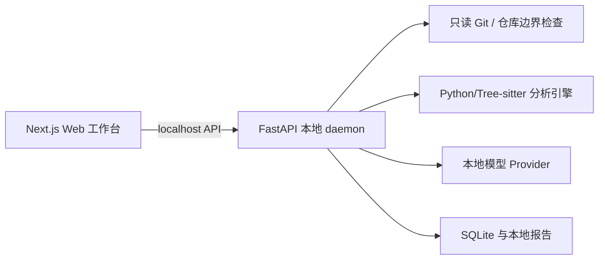
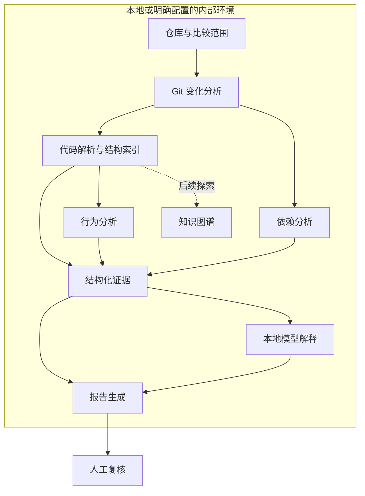

# 系统架构

状态：设计草案，所有组件尚未实现。Web 与本地服务的技术栈基线见 [tech-stack.md](tech-stack.md)；首个语言、解析器与模型适配仍待 P1 验证。

## Web 工作台与本地分析服务

开发与构建使用 Docker Compose，当前仅实现 Web 容器。后续 Web 同源 API 代理到 Compose 内网的分析容器；“localhost API”表示浏览器访问宿主机发布的 Web 回环端口，并非容器间使用 localhost。容器内监听地址、只读仓库挂载与持久化边界统一定义在 [PRD §6.1](PRD.md#61-docker-开发与交付约定)。

MorphoJudge 不是把本地仓库上传到 Web 服务器，而是由 Web 工作台连接同机的本地 daemon。浏览器负责报告查看、Diff、证据定位和人工复核；daemon 负责 Git、文件系统、解析器、规则引擎、本地模型和 SQLite。浏览器不直接访问仓库、SQLite、密钥或模型进程。

API 只接受结构化的仓库路径、基线、目标和分析选项，不接受任意 shell 命令。daemon 不运行目标仓库代码；长任务状态和失败原因通过 API 暴露。远程 Web 或远程模型属于显式配置的后续部署模式，默认不启用。

## v0.1 输入与输出

输入为本地 Git 仓库与显式指定的比较范围。输出为可阅读的审计报告及结构化证据数据。报告格式拟采用 Markdown 与 JSON，字段契约需在实现前确定。

Git 比较至少需要明确基线与目标提交；是否支持暂存区、工作区及未跟踪文件将在范围设计中逐项决定。不能将“仓库分析”含糊地等同于所有文件都已检查。

## 处理流程

## 模块职责

| 目录 | 预期职责 | 边界 |
| --- | --- | --- |
| `src/analyzer/` | Git 变化、分析编排、行为证据与影响线索 | 不执行目标仓库代码 |
| `src/parser/` | 语法解析、符号与位置、模块和调用线索 | 不支持的语法明确记录 |
| `src/scanner/` | 依赖清单、锁文件、来源与风险规则 | 无漏洞情报时不推断安全 |
| `src/llm/` | 本地推理适配、上下文构造、解释结果校验 | 模型输出不能变成执行指令 |
| `src/report/` | 组织事实、提示、假设、限制与人工检查项 | 不将未发现问题表述为安全证明 |

知识图谱先作为研究方向。v0.1 优先用轻量结构索引表示可提取的模块关系，不预先引入图数据库或完整跨语言图基础设施。

PRD 0.3 将轻量软件关系图提升为基础软件理解入口：页面/功能/方法/契约/数据的有来源关联，经邻接表遍历提供多栏浏览、宏观网络和反向影响路径；无需图数据库或 LLM。界面和输入契约位于 `app/software-map/`，当前仅接入示例事实并执行遍历/声明比较规则，真实解析尚未实现。该能力不等同于完整跨语言知识图谱。功能边界和交互唯一基线见 [PRD §12](PRD.md#12-软件理解关系地图与一致性检查)。

## 证据与解释的关系

每个发现应能携带以下信息，具体 schema 尚待设计：

- 稳定的发现标识、分析器或规则标识及版本。
- 所属提交或文件快照、文件路径、旧侧或新侧、代码位置。
- 对应 Diff 或代码片段，以及可追溯的证据来源。
- 类别、可能影响、适用前提与规则判断理由。
- 状态：提取事实、规则提示、模型假设或人工确认。
- 覆盖限制、解析失败、尚未核实的上下文。

模型解释必须引用现有证据标识。无法核实的设计意图标为假设；找不到有效证据的解释不能升级为已确认发现。影响等级与证据可靠程度需要分开表达，初版不提供未经校准的“可信分数”。

## 软件结构与行为分析

项目结构来自文件与语法信息；模块关系优先覆盖可静态解析的导入与引用。调用关系仅覆盖首个语言中可可靠提取的线索，动态分派、反射与运行时生成代码应列入限制。

首批行为类别：网络连接、外部 API、Shell 执行、文件读写与删除、权限相关逻辑。检查新引入行为时需要结合基线，避免把仓库已有行为误写为本次新增。

静态线索不能证明某条路径实际执行，也不能保证发现所有敏感数据流。

## 依赖分析

比较依赖清单与锁文件，识别新增包、版本及来源变化；显式展示 URL、Git 来源、本地路径等来源信息。首个生态与清单格式待选择。

已知漏洞匹配依赖独立情报数据，v0.1 不承诺在线漏洞服务或全量漏洞库。若未来使用本地情报快照，应记录来源与更新时间；缺少数据时显示“未检查”，不能显示“无漏洞”。

## 模型与运行时

模型候选：Qwen Coder、DeepSeek Coder、CodeLlama、StarCoder。运行时候选：Ollama、llama.cpp、vLLM。模型只接收当前分析快照中的证据和关系上下文，输出必须引用 Evidence ID；模型解释、意图归纳和候选关系均不改变确定性图。`explain` 是分析完成后的独立可选任务，不决定基础分析状态。远程 Provider 默认关闭，每次分析单独授权；这些名称目前不构成支持承诺。

适配设计需要记录模型版本、许可证、量化方式、上下文限制、内存或显存需求、超时和失败行为。模型缺失或不可用时，应允许报告仅包含基础分析结果，并说明缺失解释。

## 数据与执行边界

- 目标设计默认不上传代码、不发送遥测、不隐式调用云端模型。
- 远程或内网推理端点必须由用户显式配置，并明确代码片段会发送到该端点；内网端点不等于本机。
- 模型下载与离线审查分开设计；首次准备资源可能需要联网，审查过程不得隐式下载。
- 仓库文本、注释、README 和模型输出均作为不可信数据，不作为分析器指令。
- 分析时不安装仓库依赖，不运行构建脚本、Git hooks、包脚本或项目命令。
- 子模块不自动拉取，Git LFS 对象不自动下载；缺失内容记为覆盖限制。
- 路径与符号链接需要边界检查，防止读取分析范围之外的本地文件。
- 报告、缓存与日志可能含敏感片段，应在本地保存；不默认进入版本控制。

以上是待实现和验证的设计要求，不是当前仓库已经提供的安全能力。

## 失败与退化

解析失败、超大文件、二进制文件、未知语言、资源不足与模型超时必须进入报告的覆盖说明。部分成功可以输出报告，但不能伪装为完整扫描；错误如何影响退出状态在 CLI 设计阶段确定。

## 实现前待决策

首个语言与解析器、Git 范围语义、证据 schema、规则与模型的职责、报告格式和性能基线，分别对应 [Issue 草案](issues.md)。跨语言图与百万行仓库理解见 [开放问题](open-problems.md)。
