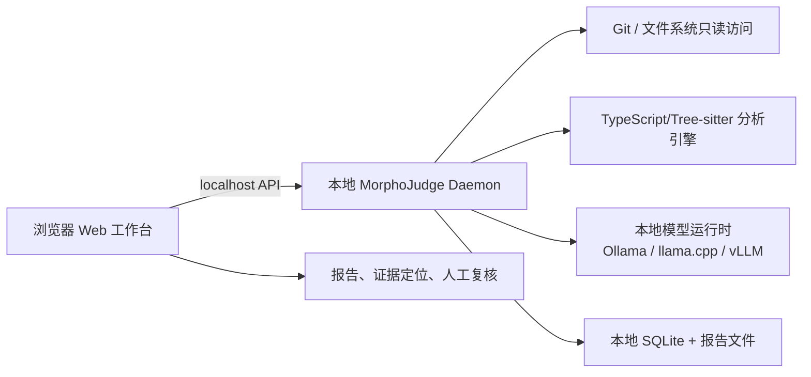

# 技术栈决策

状态：选型说明，服务于 Web 版 MVP。功能需求、技术栈基线和统一语义以 [PRD](PRD.md) 为准；本文参考 JUB829 的 Next.js、TypeScript、Tailwind 和 Playwright 经验，但没有直接复制其业务栈。

## 结论

MorphoJudge 采用 **Web 工作台 + 本地分析服务** 的组合：浏览器负责交互和报告查看；本地服务负责读取 Git、解析代码、执行确定性扫描、调用本地模型和保存审计结果。



Web 应用更适合展示多文件 Diff、证据链、模块关系和人工复核状态；本地服务解决浏览器无法安全、稳定地读取任意本地 Git 仓库的问题。浏览器不直接访问文件系统、密钥、SQLite 或模型进程。

## 分层选型

| 层 | 选择 | 采用原因 | v0.1 边界 |
| --- | --- | --- | --- |
| Web 前端 | Next.js 16 App Router + React + TypeScript strict | 延续 JUB829 的 Web 经验，适合报告路由、服务端渲染和类型共享 | 不把前端当作分析器，不在浏览器执行仓库代码 |
| UI | Tailwind CSS + shadcn/ui | 可复用、可审阅的报告界面；与 JUB829 经验一致 | 不引入新的 UI 框架或全局状态库 |
| 数据请求 | 原生 `fetch` + Zod schema | 让本地 API 契约清晰、可验证 | 不引入远程 SaaS SDK；错误状态显式展示 |
| 本地服务 | Python 3.12 + FastAPI + Pydantic | 代码分析生态成熟，便于 Tree-sitter、依赖解析和本地模型适配 | 进程只监听 localhost；不执行目标仓库命令 |
| Git | Git CLI 的受限只读调用，或 libgit2 绑定 | 准确处理 Diff、重命名和提交范围 | 先实现显式基线/目标提交；不运行 hooks、脚本和构建 |
| 解析 | Tree-sitter（首个语言待 P1 决定） | 增量语法树、位置精确，适合证据定位 | 不承诺完整跨语言调用图；解析失败进入覆盖说明 |
| 确定性分析 | Python 规则引擎 + 结构化发现 | 事实提取不依赖模型，便于测试误报和漏报 | 首批行为规则限网络、Shell、文件、权限和依赖 |
| 本地模型 | Provider 接口，首个适配 Ollama；后续评估 llama.cpp/vLLM | 易于本地安装和替换，不把某个模型写死在报告层 | 记录模型/运行时版本、许可证、资源和失败状态 |
| 存储 | SQLite（本地）+ JSON/Markdown 报告导出 | 无需数据库服务，符合 Local First，易备份 | 不采用 JUB829 的 PostgreSQL 作为 v0.1 运行依赖 |
| 图表 | Mermaid（文档）+ React 可视化组件（报告） | 先保持结构可读、依赖轻 | 知识图谱数据库留到后续研究 |
| 测试 | Vitest（Web）+ pytest（本地服务）+ Playwright（Web 流程） | 分别验证 UI、分析规则与浏览器交互 | 测试使用 fixtures 和 fake provider，不调用真实模型 |
| 工程工具 | pnpm、uv、Ruff、mypy、ESLint、Prettier | 锁定可重复开发环境 | 实际版本和命令在脚手架建立后确认 |

## 为什么不直接复制 JUB829 全栈

JUB829 的 Next.js、TypeScript、Tailwind、Drizzle、PostgreSQL、Better Auth、Tiptap、dnd-kit、three.js 和 Playwright 适合带账户、内容编辑和服务端数据库的产品。MorphoJudge v0.1 的核心问题是本地仓库分析与证据报告：

- 不需要账户、OAuth、Better Auth 或云端多租户。
- PostgreSQL 会引入服务、迁移和备份运维；本地 SQLite 更符合离线和单机审查。
- Tiptap、dnd-kit、three.js 与报告审查无直接必要，暂不引入。
- Drizzle 可以在未来需要统一数据库访问时评估，但 v0.1 的分析服务以 Python/Pydantic 和 SQLite 为主，避免跨进程共享 ORM 契约。

这不是否定 JUB829 的技术栈，而是按数据边界、分析生态和最小交付闭环重新排序。

## Web 与 Local First 的边界

### 默认部署

统一通过 Docker Compose 开发和构建，部署定义以 [PRD §6.1](PRD.md#61-docker-开发与交付约定) 为准，具体命令见 [README](../README.md)。当前仅运行 Web 原型，依赖和构建产物在容器内。后续浏览器通过 Web 同源 API 访问 Compose 内网的分析服务；用户登记的宿主仓库只读挂载到分析容器，通过仓库 ID 映射路径，不能直接传入任意宿主路径。

### 可选远程 Web

未来可以把 Web 前端部署到企业内网，但分析 daemon 仍应部署在代码所在的受控环境。公共云端 Web 不得默认接收私有代码。远程模型端点也必须显式配置，并在界面中展示数据将离开本机。

### 不采用浏览器直读仓库

浏览器文件选择器无法稳定表达 Git 历史、子模块、LFS 和权限边界；把仓库压缩上传到 Web 服务器又违背本地优先。因此 Web 只做控制面和观察面，本地 daemon 才是数据面。

## 进程与 API 契约

首个 API 资源建议包括：

- `POST /v1/analyses`：创建一次显式范围的分析任务。
- `GET /v1/analyses/{id}`：读取状态、阶段、错误和覆盖范围。
- `GET /v1/analyses/{id}/findings`：分页读取结构化发现。
- `GET /v1/analyses/{id}/report`：读取 Markdown/JSON 报告。
- `POST /v1/analyses/{id}/review`：保存人工复核状态与备注（仅本地）。

API 不接受“运行任意命令”字段，不把仓库文本拼成 shell 命令，不允许模型输出触发工具调用。长任务使用轮询起步；只有在稳定后再评估 SSE/WebSocket。

## v0.1 推荐目录

```text
app/                    # Next.js Web 工作台
  app/                  # 路由与页面
  components/           # 报告、Diff、证据组件
  lib/                  # API client 与 Zod schema
engine/                 # Python 本地分析服务
  morphojudge/          # FastAPI、Git、解析、规则、模型、报告
  tests/                # pytest fixtures
packages/contracts/     # 可选：跨前后端生成的 JSON Schema
```

当前仓库仍处于文档阶段，现有 `src/` 是未来分析器代码的占位目录。真正建立 `app/` 与 `engine/` 前，先完成 [Issue 草案](issues.md) 中的语言、证据 schema 和模型运行时选型。

## 选型验收

在宣布技术栈“已采用”前，需要完成一个最小纵向样例：Next.js 页面创建分析请求；daemon 读取 fixture Git 仓库的基线与目标提交；Tree-sitter 和规则引擎产生带位置的发现；fake provider 返回受校验的解释；SQLite 保存结果；浏览器显示报告和未知项。全流程断网可运行，且不执行 fixture 中的脚本。

## 未来重新评估触发条件

- 多用户协作、权限和企业审计成为明确需求时，再评估 PostgreSQL 与认证。
- 分析服务需要高性能并发或强隔离时，再评估 Rust 核心或独立 worker。
- 关系查询成为主要瓶颈时，再评估专用图存储。
- 浏览器与 daemon 的本地安装体验成为阻碍时，再评估 Tauri/Electron；桌面壳不是当前前置条件。
